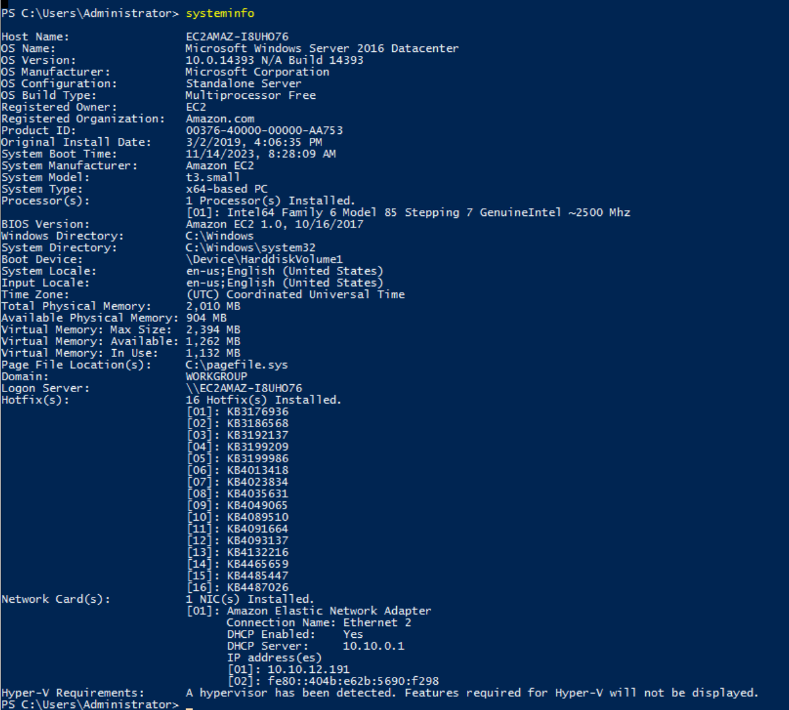
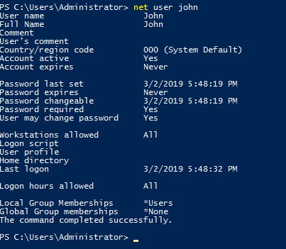
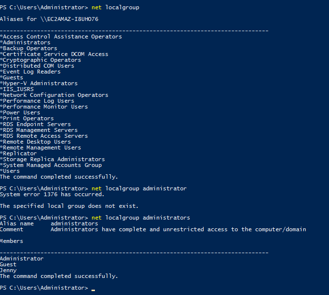

# Investigation Windows

## SOMMARIO
- Scopo


## Scopo 
Analizzare un computer Windows che è stato precedentemente compromesso.

Quindi esfiltrare le informazioni di base del sistema operativo violato.

Info da raccogliere:
- Versione del SO
- build del SO
- informazioni sull'hardware installato
- ecc.

## Prima connessione

Username: Administrator<br>
Password: letmein123!

# Versione del SO
è possibile trovare la versione del SO attraverso il comando 
```ps
PS C:\Users\Administrator> systeminfo
```


oppure dalle impostazioni -> Sistema -> Informazioni

Q: Whats the version and year of the windows machine?
A: Windows Server 2016

# Ultimo utente loggato

I registri di windows sono una fonte di informazione enorme se si sà dove cercare.

solitamente sono composti da:
- origine 
- data e ora
- dettagli delgli utenti
- ID evento

quindi aprire _Event Viewer_

i registri sono principalemte di 3 tipo:
- **Applications**: continete i registri che si verificano da un'applicazione
- **Security**: contiene i log relativi a eventuali eventi di sicurezza come Login, Logoff ecc
- **System**: contiene i log generati dal sistema operativo stesso

dal registro **Security** posso vedere l'ultimo login effettuato


Q: Which user logged in last?
A: Administrator


Q: When did John log onto the system last?<br>
Answer format: MM/DD/YYYY H:MM:SS AM/PM
A: 03/02/2019 5:48:32 PM


I registri eventi di Windows sono un record completo del sistema Windows e delle sue applicazioni. Un registro di Windows contiene l'origine del registro, la data e l'ora, i dettagli dell'utente, l'ID evento e così via.

I registri eventi possono essere visualizzati da "Visualizzatore eventi" viene preinstallato con il sistema operativo Windows.

I registri eventi sono principalmente di tre tipi -
Applicazione: contiene i registri che si verificano da un'applicazione.
Sicurezza: contiene i log relativi a eventuali eventi di sicurezza come Login, Logoff ecc.Sistema: contiene i log generati dal sistema operativo stesso.
Esempio: guasto di un driver.


```ps
PS C:\Users\Administrator> net user john+
```




```ps
PS C:\Users\Administrator> net localgroup


PS C:\Users\Administrator> net localgroup administrators
```


# ANSWAR
```
Whats the version and year of the windows machine?

Windows Server 2016
```
```
Which user logged in last?

Administrator
```

```
When did John log onto the system last?

Answer format: MM/DD/YYYY H:MM:SS AM/PM
03/02/2019 5:48:32 PM
```

```
What IP does the system connect to when it first starts?

10.34.2.3
```

```
What two accounts had administrative privileges (other than the Administrator user)?

Answer format: username1, username2
Jenny, Guest
```
