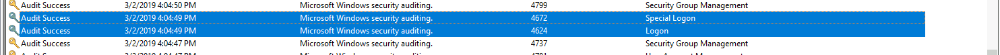
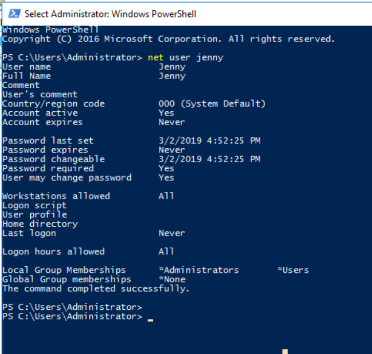
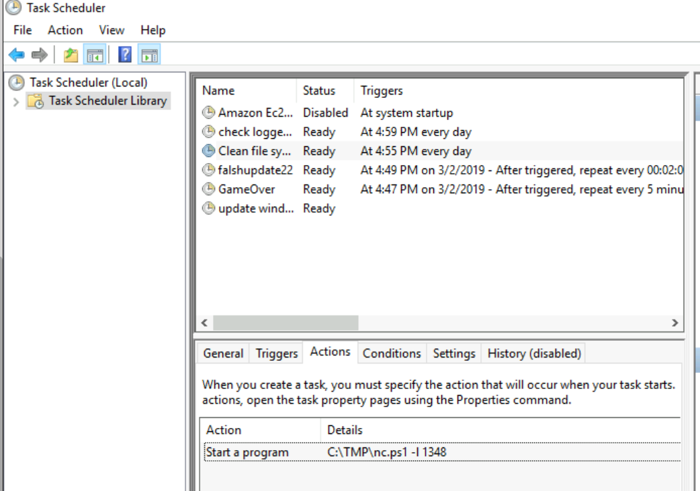
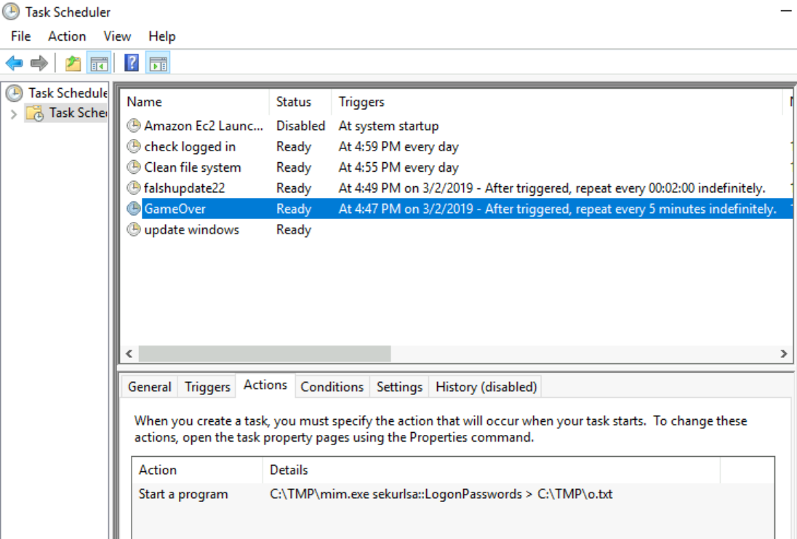
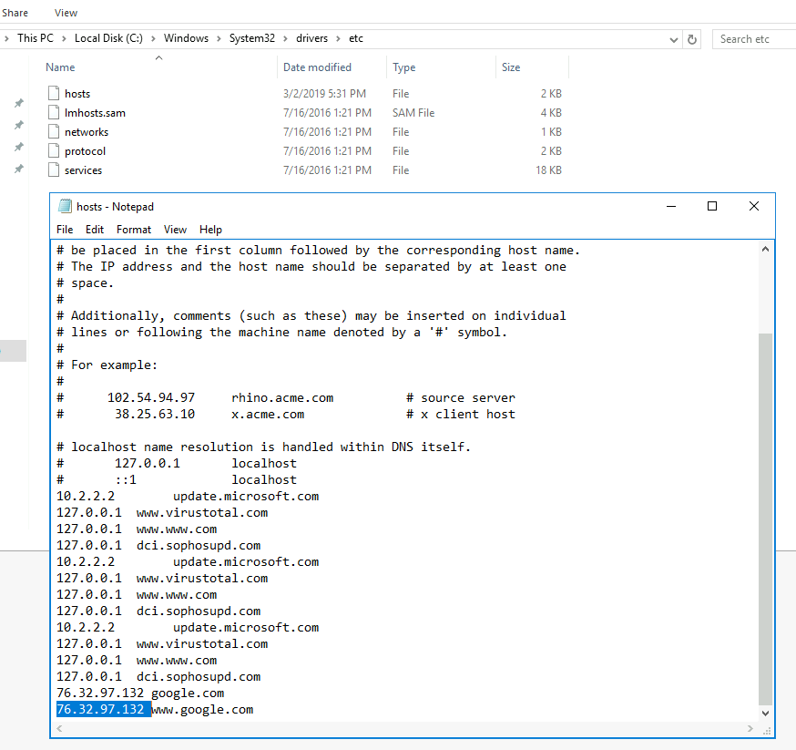
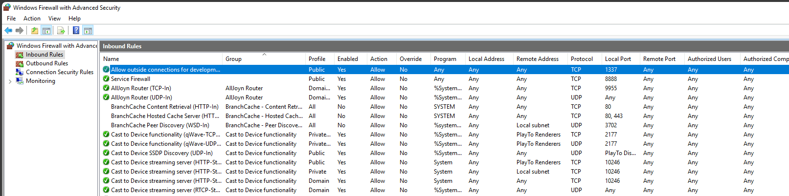
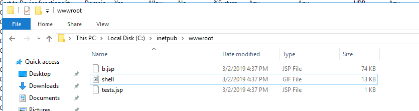

# Investigation Windows

# Scopo 
Analisi di un computer Windows che è stato precedentemente compromesso.

Sul sistema Windows, le informazioni di base come:
- la versione di Windows 
- la build del sistema operativo
- le informazioni sull'hardware installato
- ect

possono essere trovate dalle impostazioni di **Windows > Sistema > Informazioni** o digitare "**systeminfo**" nel prompt dei comandi.
```ps
PS C:\Users\Administrator> systeminfo
```


I **registri eventi** di Windows sono un record completo del sistema Windows e delle sue applicazioni. Un registro di Windows contiene l'origine del registro, la data e l'ora, i dettagli dell'utente, l'ID evento e così via.

I registri eventi possono essere visualizzati da "Visualizzatore eventi" il quale viene preinstallato con il sistema operativo Windows.

I registri eventi sono principalmente di tre tipi 
- **Applicazione**: contiene i registri che si verificano da un'applicazione.
- **Sicurezza**: contiene i log relativi a eventuali eventi di sicurezza come Login, Logoff ecc
- **Sistema**: contiene i log generati dal sistema operativo stesso.

I dettagli dell'ultimo utente connesso e il timestamp relativi all'accesso sono disponibili nella sezione **Visualizzatore eventi > Sicurezza**. 

nello screenshot sotto sono evidenziati i 2 eventi di interesse per rispondere ad alcune domande


Quindi l'ID evento:4624 per i log correlati all'accesso. 
E l'ID evento:4672 per informazioni relative al timestamp relative ai privilegi speciali assegnati a un nuovo accesso.

Per conoscere le informazioni di un utente come l'ultimo accesso, il gruppo locale o globale, le informazioni relative alla password ecc., possiamo utilizzare il comando "net user" con il nome utente dal prompt dei comandi. Solo il comando "net user" ci aiuta a conoscere gli utenti disponibili del sistema.
```ps
PS C:\Users\Administrator> net user john
```



```ps
PS C:\Users\Administrator> net localgroup


PS C:\Users\Administrator> net localgroup administrators
```

L'**Task Scheduler** di Windows è uno strumento integrato che consente di creare ed eseguire automaticamente qualsiasi attività sul sistema. La maggior parte delle volte il malware utilizza queste funzionalità per fare cose cattive sul tuo sistema.

Per conoscere il task attivo sul sistema avvia l'**Task Scheduler > la libreria dell'Utilità di pianificazione**. Facendo clic su un'attività pianificata dall'elenco, sarà possibile visualizzare ulteriori dettagli sull'attività pianificata, come il timestamp creato dell'attività, l'azione o i comandi correlati dell'attività.


Per rispondere alla domanda quale strumento è stato utilizzato per esfiltrare le password, analizzo l'attività automatizzata dall'Task Scheduler e noto che c'è un'attività chiamata "GameOver" che esegue un file chiamato "mim.exe" situato nella directory TMP del sistema.
L'eseguibile viene avviato ogni 5 minuti e salvare l'output nel file o.txt (mim-out.txt) situato nella stessa directory. Aprendo con blocconote quel file di testo è chiaro che lo strumento utilizzato è "mimikatz" e viene utilizzato per catturare la password di Windows.



Il registro di Windows è un tipo di database che contiene informazioni e impostazioni relative al software e all'hardware installati di un sistema. "Editor del Registro di sistema" viene utilizzato per visualizzare queste informazioni di registro dal sistema.

- HKEY_CLASSES_ROOT: Contiene il tipo di file, l'estensione, ecc.
- HKEY_CURRENT_USER: Contiene le impostazioni di un utente che ha effettuato l'accesso.
- HKEY_LOCAL_MACHINE: contengono informazioni sull'hardware e sul software installati e sulle relative impostazioni.
- HKEY_USERS: Contiene informazioni su tutti gli utenti presenti nel sistema.
- HKEY_CURRENT_CONFIG: contiene il profilo Hardware

HKEY_LOCAL_MACHINE\Software\Microsoft\Windows\CurrentVersion\Run

Questa chiave del Registro di sistema consente di controllare l'esecuzione dei programmi ogni volta che un utente esegue l'accesso. Questa chiave viene utilizzata anche dal malware per diventare persistente sul sistema.

Il file hosts di Windows viene utilizzato per mappare il server o il nome host agli indirizzi IP.
In Windows il percorso del file hosts è C:\Windows\System32\drivers\etc\hosts


Le regole in ingresso di Windows Firewall difendono la rete dal traffico in entrata. È sempre utile salvare il sistema da malware o attacchi DDOS. Contiene inoltre i dettagli della porta e dell'indirizzo del server locale e remoto.

è possibile raggiungere il firewall di windows dall'applicazione **Windows Firewall** oppure eseguendo **firewall.cpl > impostazioni avanzate**


Regole del traffico in ingresso di Windows Firewall
Microsoft utilizza IIS (Internet Informaion Services) come server Web predefinito in Windows. inetpub è la cartella predefinita che si trova in C:\inetpub. Contiene il contenuto del server web. wwwroot è una sottocartella posta sotto l'inetpub (C:\inetpub\wwwroot) che contiene tutto il contenuto di una pagina web.


Questo è tutto!!
