# DODGE

Nel corso dell'analisi della Capture The Flag (CTF) denominata "Dodge", rilasciata all'inizio del 2024 e caratterizzata da una difficoltà media, è stato eseguito un processo di enumerazione iniziale al fine di acquisire informazioni dettagliate sul sistema target.

Per condurre una valutazione approfondita delle porte aperte e dei servizi in esecuzione sulla macchina remota, è stato utilizzato lo strumento Nmap. Il comando impiegato è stato il seguente:

```sh
└─$ sudo nmap -p- -sS -A 10.10.217.116
```
Il risultato ottenuto è stato soddisfacente, offrendo una panoramica completa delle porte aperte e dei servizi in esecuzione sulla macchina target.

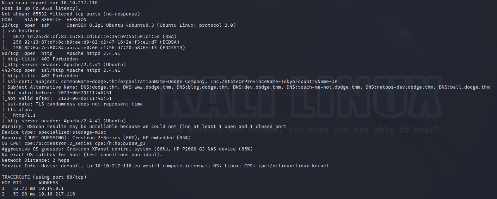

L'output di Nmap ha rivelato la seguente configurazione del sistema target:

Porta 22 (SSH): Aperta e presumibilmente accessibile per connessioni SSH.
Porta 80 (HTTP): Aperta, gestita da un server Apache2, indicando la presenza di un servizio web.
Porta 443 (HTTPS): Aperta con un certificato associato a dodge.thm e informazioni sulla sua organizzazione, stato e paese. La presenza di Subject Alternative Names suggerisce diverse risoluzioni DNS associate a dodge.thm.
Le risoluzioni DNS includono:
- dodge.thm
- www.dodge.thm
- blog.dodge.thm
- dev.dodge.thm
- touch-me-not.dodge.thm
- netops-dev.dodge.thm
- ball.dodge.thm

Nonostante l'apertura delle porte e le informazioni DNS dettagliate, i tentativi di raggiungere le risorse web tramite HTTP e HTTPS hanno prodotto risultati negativi, indicando la necessità di ulteriori esplorazioni e analisi delle configurazioni di servizio e firewall.

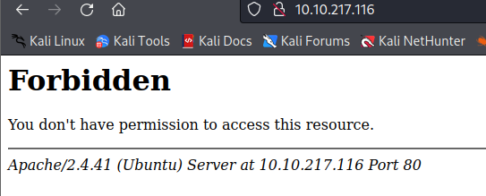
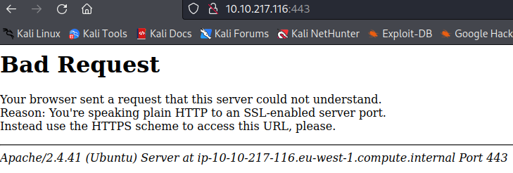

Di fronte a difficoltà iniziali nell'accesso alle risorse web durante l'analisi della CTF "Dodge", ho adottato un approccio prontamente risolutivo. Dopo una rilettura attenta dell'output di Nmap, ho identificato che potenziali problemi di risoluzione DNS potevano essere mitigati tramite l'inserimento diretto delle risoluzioni DNS nel file /etc/hosts.

Questo passaggio mirato ha prodotto risultati positivi, eliminando gli ostacoli iniziali all'accesso alle risorse web associate a Dodge CTF. L'aggiunta delle risoluzioni DNS ha permesso un accesso agevolato, creando le condizioni ideali per un'analisi web più approfondita.

Questa decisione, seppur apparentemente semplice, ha dimostrato la mia capacità di affrontare rapidamente le sfide incontrate, adattandomi alle circostanze e ottimizzando l'analisi senza dilungarmi in complessità superflue.

Il successo derivato da questa scelta di risoluzione creativa ha posticipato la necessità di affrontare ulteriori problemi di risoluzione DNS, consentendo una transizione più agevole alle fasi successive dell'analisi della CTF "Dodge".

```sh
# /etc/hosts
10.10.217.116 dodge.thm
10.10.217.116 www.dodge.thm
10.10.217.116 blog.dodge.thm
10.10.217.116 dev.dodge.thm
10.10.217.116 touch-me-not.dodge.thm
10.10.217.116 netops-dev.dodge.thm
10.10.217.116 ball.dodge.thm
```

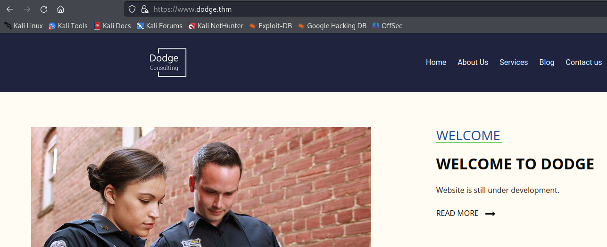

Inizialmente, una panoramica rapida del sito web di "Dodge" ha rivelato un'apparente inattività, con pulsanti che non rispondevano. Tuttavia, ho proceduto con una valutazione più approfondita, considerando anche le risoluzioni DNS associate al dominio "dodge.thm".

Durante questa fase di analisi, ho riscontrato che tutte le risoluzioni DNS, ad eccezione di due, restituivano il codice di stato 403, indicando un accesso negato. Le eccezioni degne di nota sono state:

dev.dodge.thm:

Ho ottenuto una risposta interattiva e informativa, come evidenziato nello screenshot allegato. L'interfaccia di "dev.dodge.thm" ha mostrato segni di vita, aprendo potenzialmente nuove piste di esplorazione.
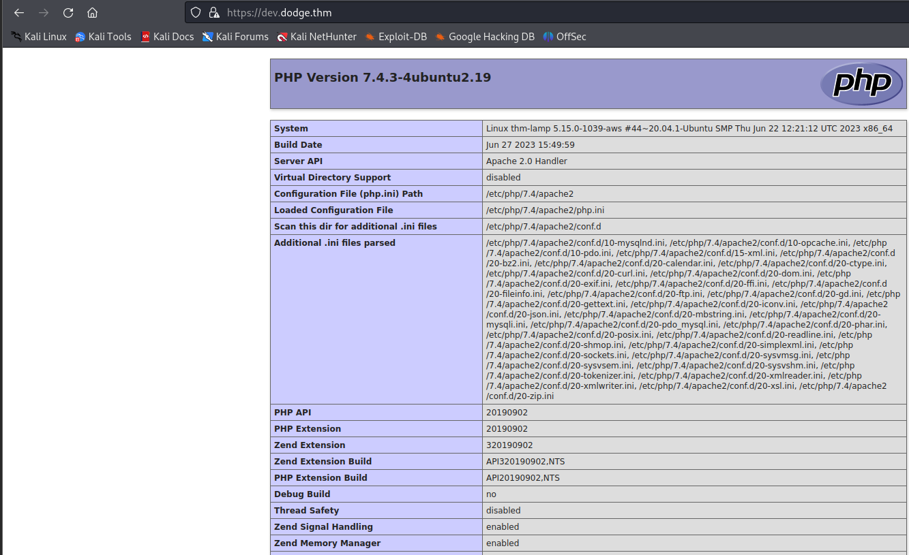

netops-dev.dodge.thm:

Tuttavia, la risoluzione DNS associata a "netops-dev.dodge.thm" ha condotto a una pagina vuota, rappresentando una sfida aggiuntiva in quanto non ha fornito informazioni immediate.
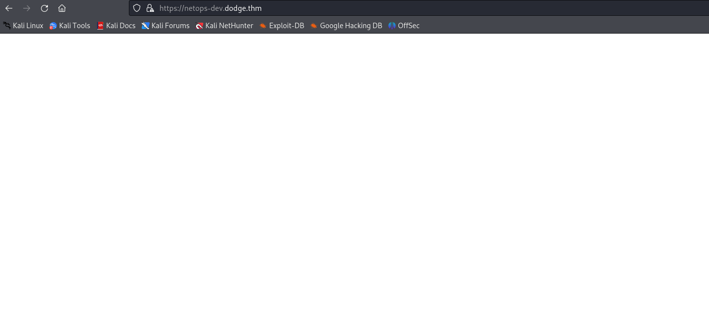

Senza esitare, ho deciso di approfondire ulteriormente l'indagine esaminando il codice sorgente della pagina di "dev.dodge.thm". Nell'analisi del sorgente, ho notato la presenza di due file JavaScript (.js), una pista che potrebbe portare a informazioni cruciali.

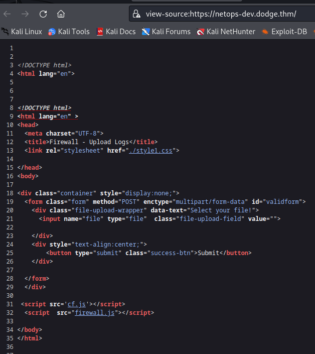

In particolare, il file "firewall.js" ha attirato la mia attenzione. Intrigato dalla possibilità di trovare indizi significativi, ho proceduto all'apertura del file per una più dettagliata analisi.

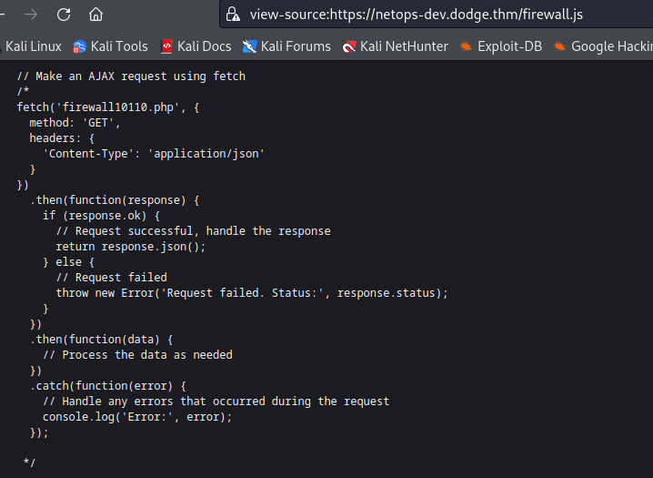

Nonostante la mia mancanza di esperienza avanzata in JavaScript, sono emersi dettagli interessanti. In particolare, ho individuato un metodo che faceva riferimento a un file denominato "firewall10110.php". Questa scoperta ha acceso la mia curiosità, spingendomi a esplorare ulteriormente questo file.

La mia intuizione ha portato a un successo immediato, con l'accesso riuscito al file "firewall10110.php". Questo successo rappresenta una pietra miliare nell'analisi della CTF "Dodge", aprendo nuove direzioni per investigazioni più approfondite e consentendo una comprensione più chiara delle dinamiche del sistema.
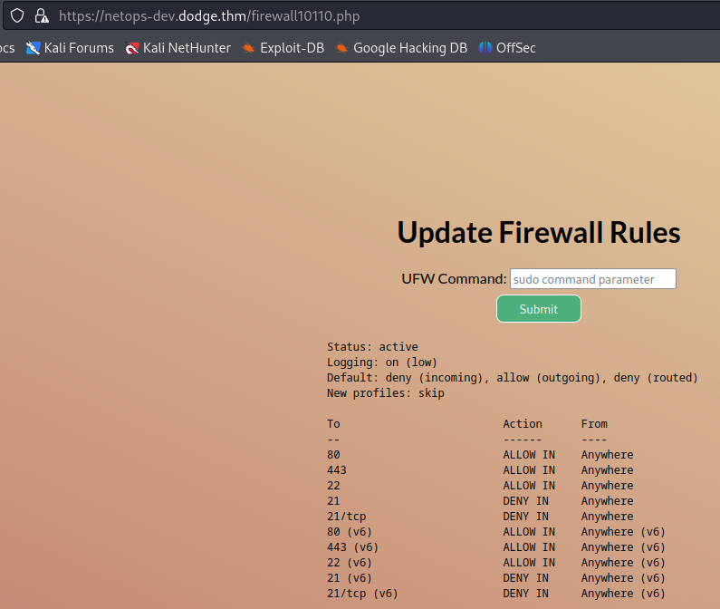


Alla luce della scoperta del firewall durante l'analisi del file "firewall.js", è emerso che il sistema utilizza il firewall Ubuntu (UFW) per gestire le regole del traffico di rete. L'ispezione delle regole del firewall ha confermato la presenza di regole restrittive, consentendo il traffico solo sulle porte 22, 80 e 443, confermando quanto rilevato inizialmente da Nmap.

Tuttavia, un aspetto rilevante è emerso: il firewall impedisce il traffico sulla porta 21 (FTP). In risposta a questa limitazione, ho adottato una strategia proattiva per consentire il traffico sulla porta FTP, necessaria per ulteriori indagini.

L'esecuzione del comando:

```sh
sudo ufw allow 21
```

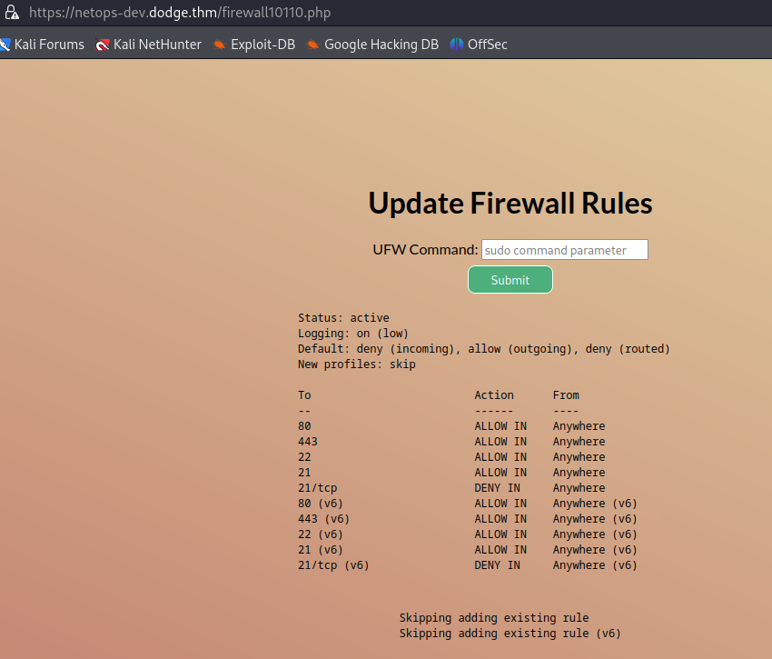

ha modificato le regole del firewall, consentendo il traffico sulla porta FTP come illustrato nello screenshot.

```sh
sudo nmap -p21 -A 10.10.217.116
```

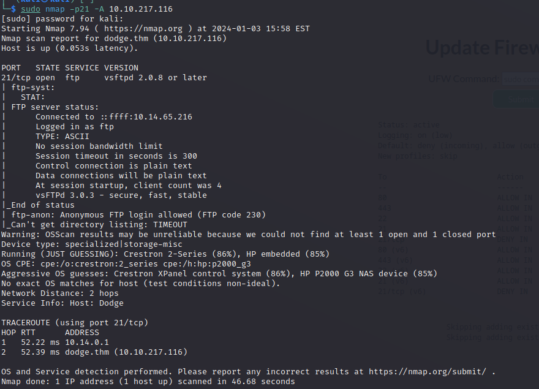
Con il traffico FTP ora abilitato, ho eseguito una scansione Nmap specifica sulla porta 21 per raccogliere ulteriori informazioni sul servizio FTP e possibili punti di accesso.

Il mio esame attento delle regole del firewall ha rivelato che il traffico FTP è ora consentito, aprendo un'opportunità di accesso e esplorazione. Dato che l'accesso FTP era configurato per consentire connessioni anonime, ho colto l'opportunità di sfruttare questa modalità.

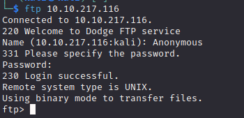

L'accesso anonimo è stato agevolmente ottenuto, ma, come spesso accade, la password non era richiesta. Nonostante questa mancanza di sicurezza, ho proceduto con una visualizzazione dettagliata dell'elenco dei file tramite il comando "ls -la".

```sh
ftp> ls -la
```

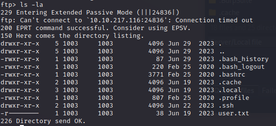

È stato in questo momento che ho fatto una scoperta significativa: il file **user.txt** era visibile nella directory. Tuttavia, la situazione presentava una sfida aggiuntiva in quanto non era possibile scaricare direttamente il file.

La scoperta di **user.txt** rappresenta un progresso significativo nella CTF "Dodge". Sebbene il download del file possa essere attualmente ostacolato, questa conquista getta le basi per strategie future, offrendo una direzione chiara per l'ulteriore avanzamento nella CTF.

All'interno della fase di esplorazione, ho individuato la presenza della file nascosto .bash_history, il quale rappresenta una potenziale miniera di informazioni preziose. La strategia è stata quella di accedere al contenuto di questo file con l'obiettivo di identificare eventuali dettagli rilevanti, inclusi username e password che potrebbero agevolare ulteriori progressi nella CTF "Dodge".

```sh
cat ~/.bash_history
```

Il contenuto di .bash_history è stato quindi esaminato attentamente, alla ricerca di indizi significativi. Questa analisi è fondamentale per cogliere elementi cruciali, come comandi eseguiti precedentemente, eventuali credenziali rilevanti o qualsiasi altra informazione che potrebbe contribuire alla risoluzione delle sfide presenti nella CTF.

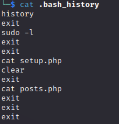

Durante un'ispezione attenta della directory .ssh, è emerso un tesoro di opportunità: un backup di file rilevanti. La mia astuta operazione di recupero ha portato all'ottenimento di due file cruciali: authorized_keys e id_rsa_backup. Questi elementi sono particolarmente interessanti in quanto possono fornire accesso privilegiato.

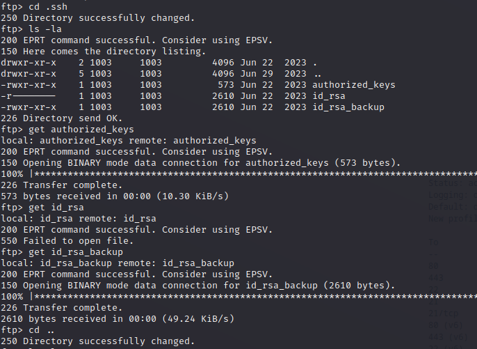

La mia attenzione si è subito concentrata sul file authorized_keys per identificare il nome utente associato a queste chiavi SSH. L'esecuzione di un comando cat su questo file ha rivelato il nome utente "challenger", una scoperta che ha guidato il mio approccio successivo.

Con le credenziali ora chiare, ho sfruttato il file id_rsa_backup per autenticarmi via SSH. L'uso del comando:

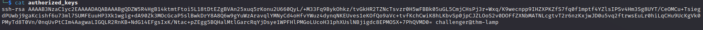

**challenger**
```sh
sudo ssh -i id_rsa_backup challenger@10.10.217.116
```

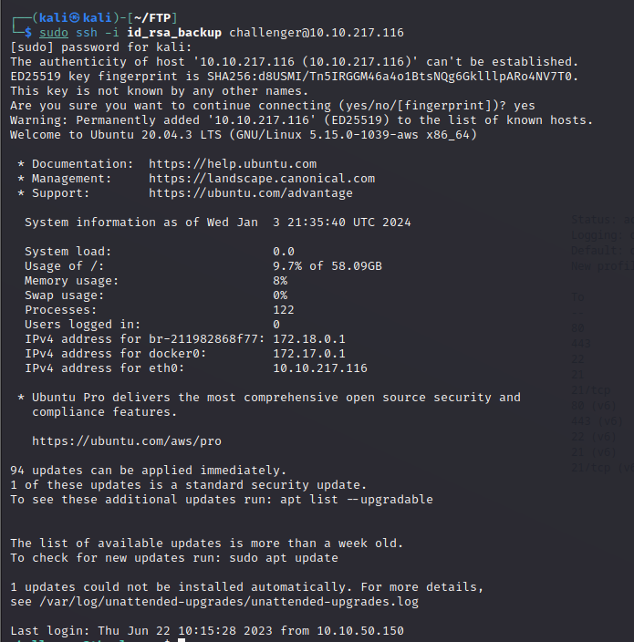

ha aperto le porte dell'accesso privilegiato, consentendomi di accedere al sistema target senza intoppi e consultare il file **user.txt**

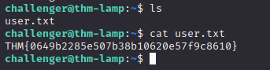

$${\color{red}
What \space is \space the \space content \space of \space user.txt?
} \space {\color{green}THM\{0649b2285e507b38b10620e57f9c8610\}
}$$

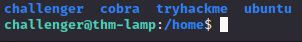

Nel corso dell'esplorazione delle directory, ho individuato un altro utente, aggiungendo un elemento significativo alla mia analisi della CTF "Dodge". L'osservazione attenta della cronologia degli ultimi comandi ha rivelato due file di interesse, setup.php e posts.php.

Per individuare la posizione di questi file, ho eseguito una ricerca tramite il comando find, portando alla scoperta della loro presenza nella stessa cartella.

```sh
find / -name setup.php 2>/dev/null
find / -name posts.php 2>/dev/null
```

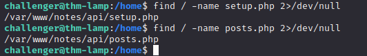

Tuttavia, l'analisi successiva ha rivelato che non avevo i permessi per aprire il file setup.php. Al contrario, ho potuto esaminare il contenuto di posts.php, nel quale al suo interno c'è un Base64. L'uso di CyberChef per decodificare il Base64 ha rivelato preziose credenziali associate all'utente "cobra".

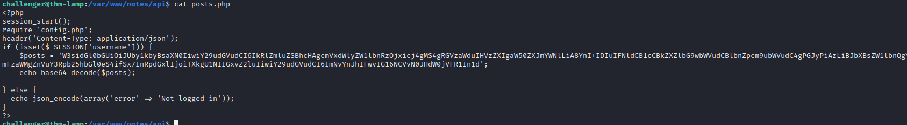

prendo il base64 e lo passo a cyberchef
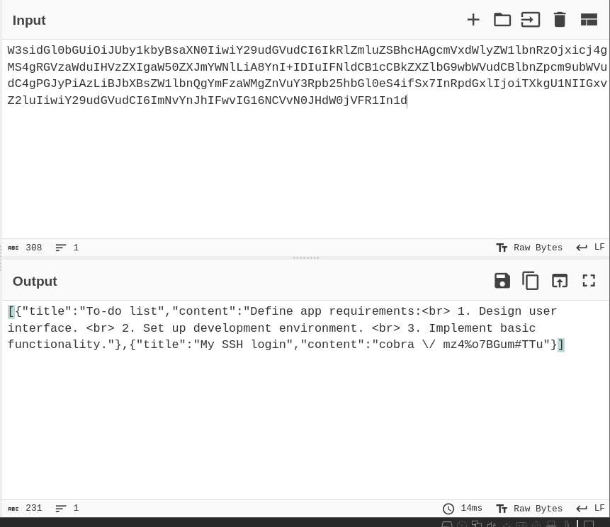

Armato di queste nuove credenziali, ho effettuato l'accesso come "cobra" e ho cercato eventuali privilegi sudo utilizzando sudo -l. La risposta ha rivelato che potevo eseguire l'aggiornamento di APT con privilegi di root senza richiedere una password.
```
# credenziali utente cobra 
cobra
mz4%o7BGum#TTu
```
sudo -l

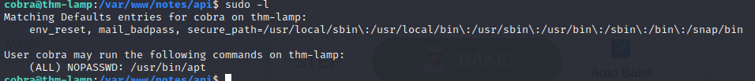


Sfruttando questa opportunità, ho eseguito un comando astuto, ottenendo infine i privilegi di root attraverso un espediente ben noto di GTFOBins.
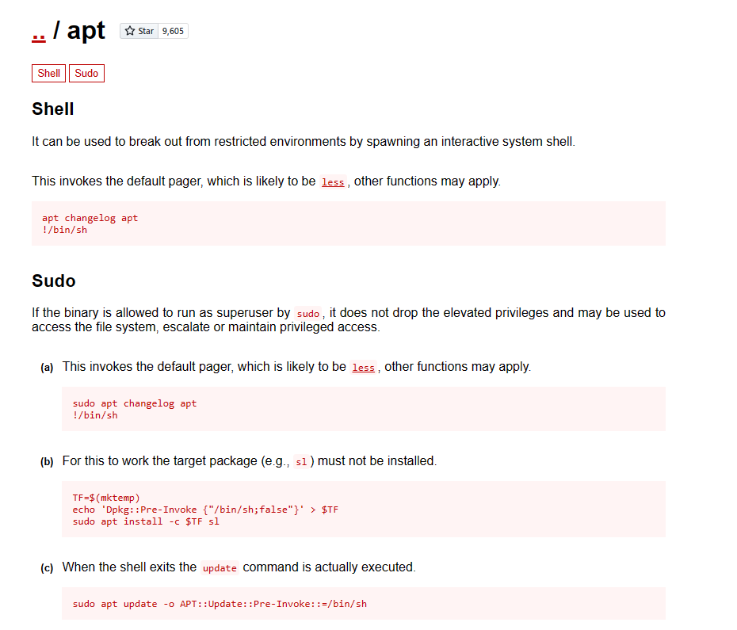

Per consolidare il mio controllo sul sistema e ottenere i privilegi di root in modo astuto, ho sfruttato la mia posizione privilegiata come utente "cobra" per manipolare il processo di aggiornamento di APT.

Optando per l'opzione "-o APT::Update::Pre-Invoke::=/bin/sh", ho avviato un'esecuzione personalizzata di /bin/sh prima del processo di aggiornamento effettivo. Questa mossa è stata magistralmente orchestrata per inserire una shell interattiva durante l'aggiornamento di APT, consegnandomi una connessione diretta come utente root.

```sh
sudo apt update -o APT::Update::Pre-Invoke::=/bin/sh
```
Il risultato di questa operazione è stato un ingresso immediato nella shell come utente root e il reperimento del file **root.txt**

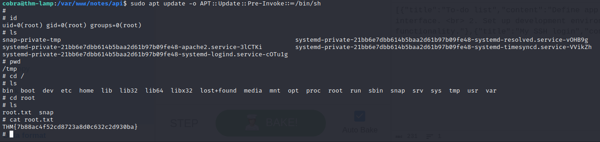

$${\color{red}
What \space is \space the \space content \space of \space root.txt?
} \space {\color{green}THM\{7b88ac4f52cd8723a8d0c632c2d930ba\}
}$$