# Simple CTF

Benvenuto alla sfida "Simple CTF" su TryHackMe! Nonostante la sua descrizione minimale, questa CTF è progettata per guidarti attraverso alcune delle competenze fondamentali richieste in molte competizioni di hacking, fornendo un'esperienza ideale per i principianti.

La sfida "Simple CTF" è un ambiente sicuro e controllato che ti permette di esplorare e padroneggiare le competenze essenziali delle CTF. Il percorso include fasi cruciali come la scansione e l'enumerazione, la ricerca di vulnerabilità, lo sfruttamento e l'escalation dei privilegi.

**Cosa aspettarti**:

**Scansione ed Enumerazione**: Utilizza strumenti di scansione per identificare i servizi in esecuzione sulla macchina bersaglio e raccogli informazioni cruciali per avanzare nella tua missione.

**Ricerca**: Scava nella profondità del sistema per individuare punti deboli e vulnerabilità nascoste. La ricerca è la chiave per trovare le vie di accesso.

**Sfruttamento**: Una volta individuate le debolezze, metti in pratica le tue abilità di sfruttamento per guadagnare l'accesso non autorizzato. Affina la tua abilità nell'arte dell'hacking etico.

**Escalation dei Privilegi**: Supera le sfide aggiuntive che possono sorgere una volta ottenuto l'accesso. L'escalation dei privilegi ti aiuterà a ottenere il controllo completo del sistema.

**Obiettivi**:

- Trova e sfrutta le vulnerabilità.
- Raccogli le informazioni necessarie per completare la sfida.
- Scala i privilegi per ottenere il controllo totale.

e rispondi a tutte le domande...

Ricorda, questa CTF è pensata per i principianti, quindi non preoccuparti se sei alle prime armi. Utilizza questa opportunità per migliorare le tue abilità e diventare un esperto nell'arte dell'hacking etico. Buona fortuna, e che l'avventura inizi!

## SOLUZIONE 
_per completare la stanza rispetterò l'ordine delle domande_

Per iniziare provo a fare una scansione delle porte aperte, questo approccio mi è indicato dalla prima domanda

```sh
└─$ nmap -p- -sS -A 10.10.248.183
```
l'output indica che ci sono 3 porte aperte:
- Port 21 (Servizio FTP): Il server FTP vsftpd 3.0.3 è in esecuzione, consentendo l'accesso anonimo.
- Port 80 (Servizio HTTP): Apache httpd 2.4.18 è in esecuzione su Ubuntu, con una pagina predefinita che indica il funzionamento di Apache e un file robots.txt con voci disallow.
-  Port 2222 (Servizio SSH): OpenSSH 7.2p2 è in esecuzione su Ubuntu 4ubuntu2.8 sulla porta 2222/tcp.

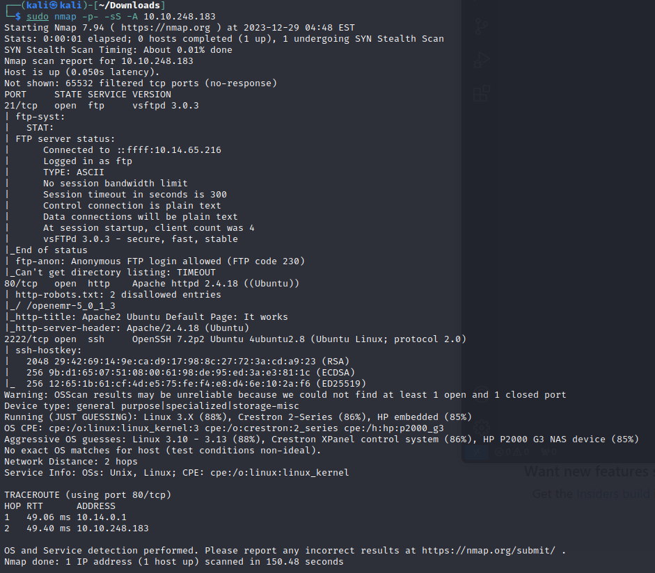
```diff
- Quanti servizi sono in esecuzione sotto la porta 1000?
```

<span class="Q">
Quanti servizi sono in esecuzione sotto la porta 1000?
</span>
<span class="A">
2
</span>

<span class="Q">
Cosa è in esecuzione sulla porta superiore?
</span>
<span class="A">
SSH
</span>

L'output di Nmap ci viene di nuovo in aiuto fornendoci anche la risposta della seconda domanda

Ora è necessario raccogliere qualche informazine in più.

sappiamo che la porta 80 espone un Apache quindi proviamo a visitare il sito

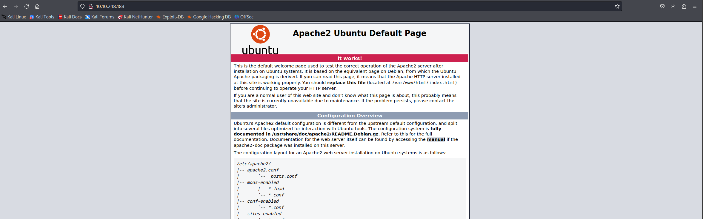

abbiamo la conferma che il server Web è un Apache2 come indicato da Nmap.

ora provo con gobuster a fare una scansione del sito alla ricerca di altre pagine.

ho utilizzato DirBuster con la wordlist /usr/share/wordlists/dirbuster/directory-list-2.3-medium.txt

è possibile anche usare GoBuster; lascio per completezza il comando:
```sh
└─$ gobuster dir -u http://10.10.248.183:80 -w /usr/share/wordlists/dirbuster/directory-list-2.3-medium.txt -t 100 
```
**dir** cerca solo le cartelle
**-u** è l'url
**-w** è la wordlist
**-t** sono i threads

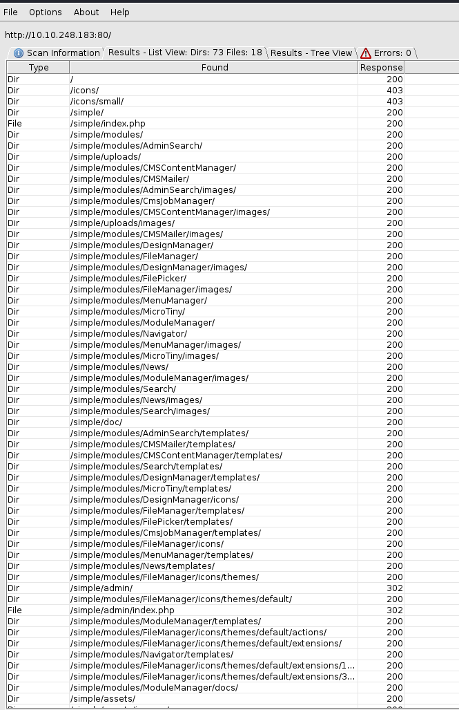

ho trovato molte directory e file; visiterò /simple/ nella quale c'è index.php

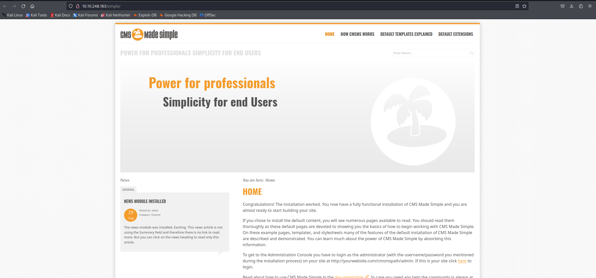

la pagina è riferita ad un CMS chiamato CMS Made Simple. in fondo alla pagina è possibile vedere la versione.

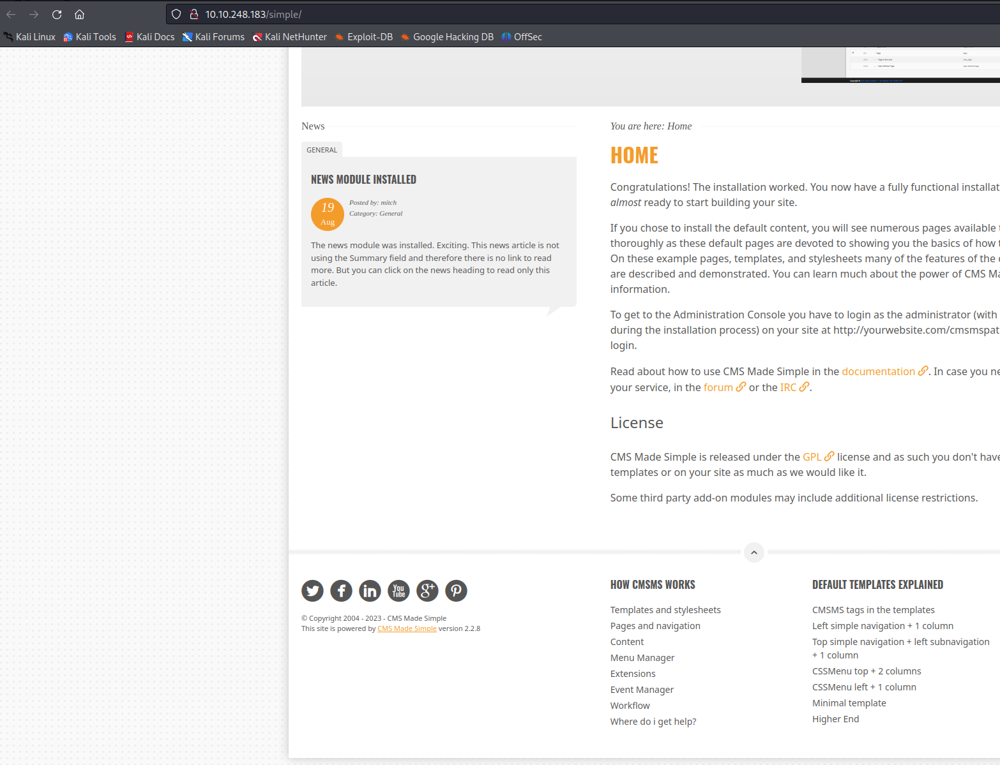

direi che è possibile fare una ricerca su google inserendo qualcosa del genere "_CMS Made Simple version 2.2.8 exploit_"

Il primo link di google è di exploit-db: https://www.exploit-db.com/exploits/46635

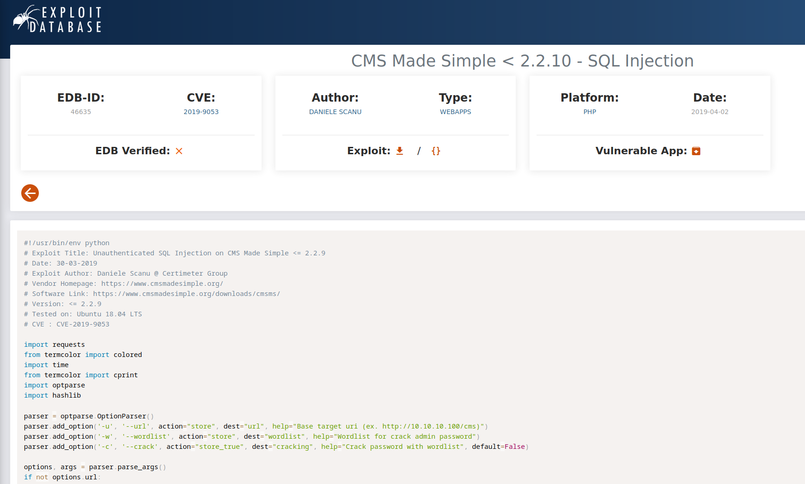

questa pagina ci fa rispondere alle successive 2 domande

<span class="Q">
Qual è il CVE che stai usando contro l'applicazione?
</span>
<span class="A">
CVE-2019-9053
</span>

<span class="Q">
A che tipo di vulnerabilità è vulnerabile l'applicazione?
</span>
<span class="A">
SQLi
</span>

l'exploit è uno stript in python quindi lo ho capiato e incollato in un file .py

per comodità l'ho chiamato con il nome del CVE 
```sh
└─$ nano CVE-2019-9053.py
```
dando un'occhiata veloce al codice vengono importati dei moduli che sono per lo più built-in.
I moduli da installare sono: **termcolor** e **requests**.

quindi all'interno della directory in cui si trova il file .py installo un venv
```sh
└─$ python3 -m venv venv 
```
e successivamente lo attivo
```sh
└─$ source ./venv/bin/activate
```
ora posso installare termcolor e requests senza rischiare un confiltto di versioni, ma sopratutto senza sporcare la mia Kali.
```sh
└─$ pip install termcolor requests
```
Ora provo a eseguirlo e vediamo cosa ottengo in cambio. Se non si conosce la sintassi, si può eseguire lo script senza argomenti e ti darà alcune informazioni su cosa inserire, una sorta di Help.

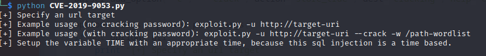

Qui possiamo vedere che abbiamo bisogno di fornire: 
- URL usando il flag -u 
- una wordlist per il cracking delle password usando -w.
```sh
└─$ python CVE-2019-9053.py -u http://10.10.248.183/simple/ --crack -w /usr/share/wordlists/rockyou.txt 
```
Ora, eseguiamolo e vediamo cosa otteniamo in cambio.

Il risultato è che abbiamo trovato:
```output
[+] Salt for password found: 1dac0d92e9fa6bb2
[+] Username found: mitch
[+] Email found: admin@admin.com
[+] Password found: 0c01f4468bd75d7a84c7eb73846e8d96
[+] Password cracked: secret
```
quindi possiamo rispondere alle seguenti domande:

<span class="Q">
Qual è la password?
</span>
<span class="A">
secret
</span>

<span class="Q">
Dove si può accedere con i dati ottenuti?
</span>
<span class="A">
SSH
</span>

ovviamente proverò subito ad eseguire l'accesso tramite SSH

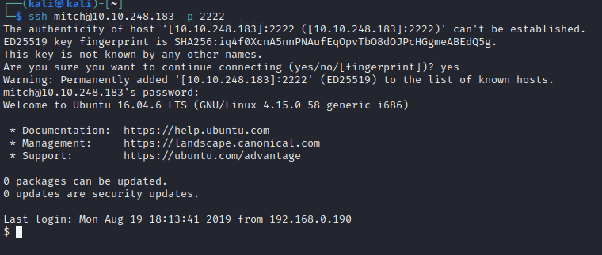

Bingo!

Ora vediamo dove sono e cosa c'è nella home del utente mitch

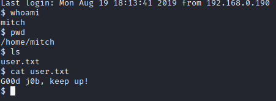

quindi posso rispondere alla domanda:

<span class="Q">
Qual è il flag dell'utente?
</span>
<span class="A">
G00d j0b, keep up!
</span>

è facile rispondere anche a quella dopo dopo:
<span class="Q">
C'è qualche altro utente nella home directory? Come si chiama?
</span>
<span class="A">
sunbath
</span>

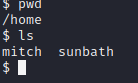

per generare una shell con privilegi è necessario fare un paio di ricerche su google. Ma prima ho bisogno di conoscere se l'utente mitch può eseguire dei binari senza password.
per fare questo posso vedere quali binari sono consentiti a mitch con il comando:
```sh
└─$ sudo -l
```
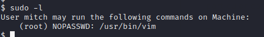

<span class="Q">
Cosa puoi sfruttare per generare una shell privilegiata?
</span>
<span class="A">
vim
</span>

Posso vedere che l'utente "mitch" può eseguire /usr/bin/vim senza una password. Questa informazione mi servirà per rispondere all'ultima domanda.

Diamo un'occhiata a GTFOBins e vediamo se possiamo usarlo per privesc.

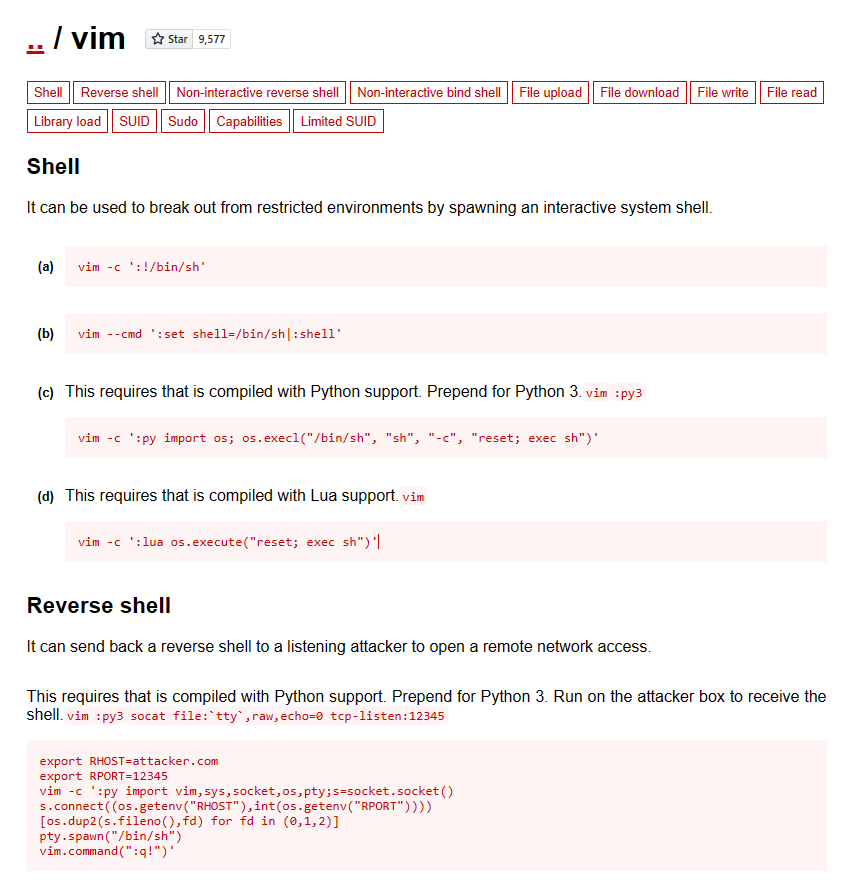
url: https://gtfobins.github.io/gtfobins/vim/

La documentazione dice che se eseguo questo comando qui posso aumentare i miei privilegi!

```sh
└─$ sudo vim -c ':!/bin/sh'
```
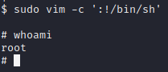

<span class="Q">
Che cos'è il flag di radice?
</span>
<span class="A">
W3ll d0n3. You made it!
</span>

Finita!!!

<style>
    .Q {
        font-weight: bold;
        color: red;}
    .A {
    font-weight: bold;
    color: Green;}
</style>
